**中文** | [English](README_EN.md)

# Creation-SSH（C-SSH）

### 手机上也能接着运维：持久化终端、常驻监控、文件管理与 AI 助手

Creation-SSH 是一套跨平台 SSH 运维客户端。Android 不是只读遥控器：它可以直接管理主机、恢复服务端 tmux 持久化会话、查看监控、处理文件、调用 AI 助手和进入系统管理；Windows 与 Linux 桌面端负责更完整的日常运维工作流。

核心能力由 Linux 服务器上的常驻 agent 结构化提供，普通终端和端口映射仍保留纯 SSH 路径。当前公开稳定版为 **`v0.6.16`**；`v0.6.11` 是已保留的预发布历史版本，不建议安装。

## v0.6.16 更新重点

- Windows 与 Linux 延续 11 个主要工作区的紧凑单层布局；主机行在 960px 及以上保持单行，终端控件并入顶部工具栏，小窗口和高 DPI 下仍可收缩使用。
- 桌面终端新增独立窗口入口，可同时打开多个终端窗口并行操作；连接状态并入主机选择器，连接/断开动作随当前状态切换，tmux 窗口列表不再用服务端“活动”标记暗示当前选择。
- Android 终端、文件、监控与 AI 保持紧凑移动交互：终端提供移动快捷操作，文件页折叠深层路径并支持 SAF 单文件上传，监控合并主机状态，AI 合并会话入口。
- Android 文件上传继续使用分块传输、SHA256 完整性校验与当前远端目录目标冻结；主机操作提供安装 agent 与更新/修复 agent，并优先复用本地保险库凭据。
- Windows、Linux 与 Android 的部署资源均加入 `x86_64 agent + x86_64 静态 tmux` 和 `aarch64 agent + aarch64 静态 tmux` 两套独立配对；客户端在已认证 SSH 中只读执行 `uname -m`，仅上传匹配的一对。
- aarch64 资源与自动选择基础已经实现；真实 ARM 服务器 no-mock 运行尚待验证，因此本版本不宣称完整 ARM64 服务器支持。
- 三端继续使用主机硬删除与生命周期隔离：删除会清理可归属的本地凭据、会话、窗口和监控状态，之后以相同 ID 或地址重加仍从全新生命周期开始。

## 先看 Android

同一套主机和 tmux 会话可以在桌面与手机之间继续使用。Android `v0.6.16` 的正式公开资产为 arm64 APK/AAB；公开 Release 不提供 x86_64 模拟器测试包。

## 下载

| 平台 | 推荐下载 | 其他正式资产 |
| --- | --- | --- |
| Android arm64 | [APK](https://github.com/suiyuebaobao/C-SSH/releases/download/v0.6.16/C-SSH_0.6.16_android-arm64.apk) | [AAB](https://github.com/suiyuebaobao/C-SSH/releases/download/v0.6.16/C-SSH_0.6.16_android-arm64.aab)，用于应用商店分发 |
| Windows x64 | [安装版 EXE](https://github.com/suiyuebaobao/C-SSH/releases/download/v0.6.16/Creation-SSH_0.6.16_x64-setup.exe) | [MSI](https://github.com/suiyuebaobao/C-SSH/releases/download/v0.6.16/Creation-SSH_0.6.16_x64_en-US.msi) · [便携版 ZIP](https://github.com/suiyuebaobao/C-SSH/releases/download/v0.6.16/Creation-SSH_0.6.16_portable-Windows-x64.zip) |
| Linux x86_64 | [AppImage](https://github.com/suiyuebaobao/C-SSH/releases/download/v0.6.16/Creation-SSH_0.6.16_linux-x86_64.AppImage) | [Debian/Ubuntu deb](https://github.com/suiyuebaobao/C-SSH/releases/download/v0.6.16/Creation-SSH_0.6.16_linux-amd64.deb) |

版本说明和 SHA256 见 [v0.6.16 Release](https://github.com/suiyuebaobao/C-SSH/releases/tag/v0.6.16)，历史记录见 [CHANGELOG.md](CHANGELOG.md)。

## 已交付平台

| 平台 | `v0.6.16` 已交付范围 |
| --- | --- |
| Android | 主机管理、agent 安装与更新/修复、持久化/普通终端、文件上传下载、实时监控、AI、系统管理、本地登录门与“我的”设置 |
| Windows | 完整桌面工作流；提供 EXE、MSI 与便携 ZIP |
| Linux 桌面 | 独立 AppImage/deb；提供持久化终端、监控、系统/进程、文件、AI 与失效重连工作流 |
| Linux agent 部署资源 | `x86_64` 与 `aarch64` 的 agent/静态 tmux 独立配对，经认证 SSH 执行 `uname -m` 后只选择匹配资源；aarch64 真机 no-mock 尚待验证，不宣称完整 ARM64 支持 |
| iOS / macOS | **尚未发布**，不属于 `v0.6.16` 已交付范围 |

## 主要页面

### Android

| 页面 | 能做什么 |
| --- | --- |
| 主机 | 新增、编辑和硬删除主机；硬删除清除本机关联状态，部署/修复 agent，进入终端、监控和系统管理 |
| 终端 | 在可重连的 tmux 持久化终端与普通 SSH PTY 间切换；支持窗口、字体、尺寸、滚动、复制和移动快捷键 |
| 文件 | 浏览、编辑、新建、重命名和删除远端文件；通过 Android SAF 选择单个文件上传或选择下载位置，保留分块传输、断点续传与完整性校验 |
| 监控 | 查看 CPU、内存、磁盘、网络、磁盘 I/O 和 Top 进程；后台跨主机采集设置保存在本地 SQLite |
| AI 助手 | 选择主机、模型与权限档，查看历史和上下文；工具执行受权限与确认控制 |
| 系统管理 | 查看系统信息、进程和防火墙端口，执行杀进程与修改 SSH 密码等需确认操作 |
| 我的 / 登录门 | 语言、主题、版本、更新与本地安全设置；设置登录密码后先解锁本地保险库 |

### Android 产品截图

以下每张截图都对应一段清晰的功能说明，并已在公开前完成脱敏核对。

#### 主机管理

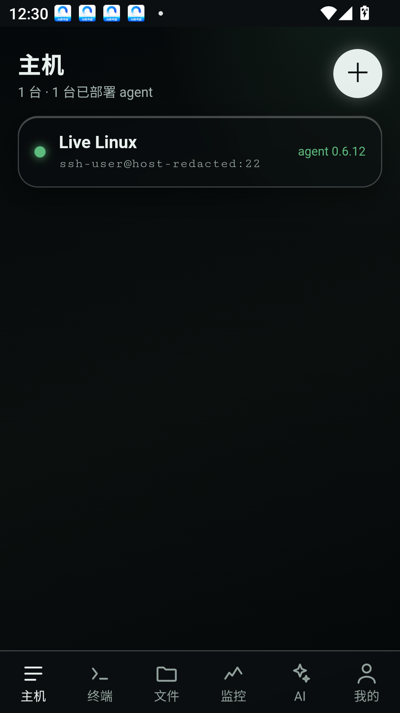

集中查看主机连接状态和 agent 部署信息，也可以安装、更新/修复 agent，或新增、编辑和硬删除主机。硬删除会结束该主机的本地生命周期；之后即使使用相同 ID 或地址重新添加，也会作为全新主机开始。

#### 持久化与普通终端

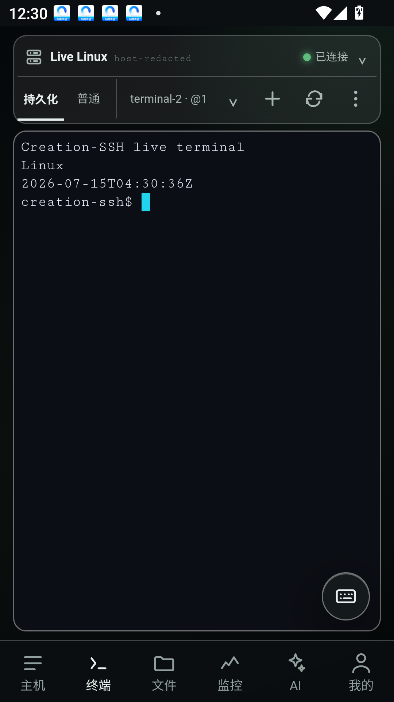

在可重连的 tmux 持久化终端与普通 SSH 终端之间切换，并管理当前窗口。持久化会话支持重新附加，方便在手机上继续之前的命令行工作。

#### 文件管理

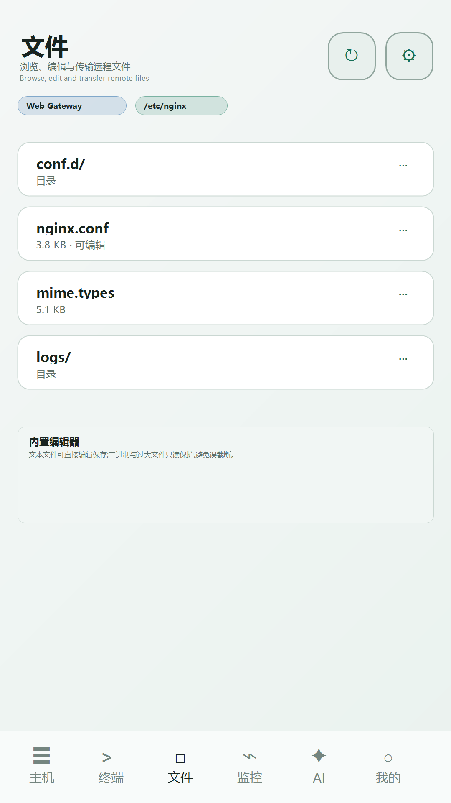

使用紧凑两行工具栏浏览远端目录、折叠深层路径、新建文件或文件夹并切换隐藏文件。上传通过 Android 系统文件选择器选取单个本地文件，下载同样由用户选择保存位置。

#### 实时监控

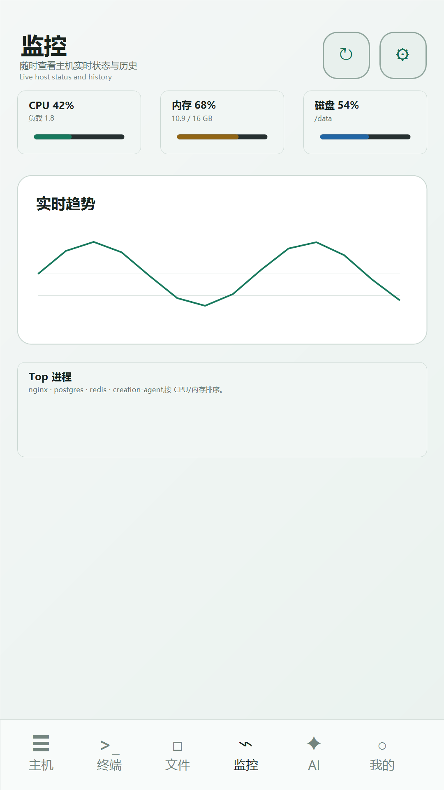

实时查看 CPU、内存、负载、网络、磁盘、磁盘 I/O 和 Top 进程。页面同时显示监控状态与运行时长，便于在移动端快速判断主机健康情况。

#### AI 助手

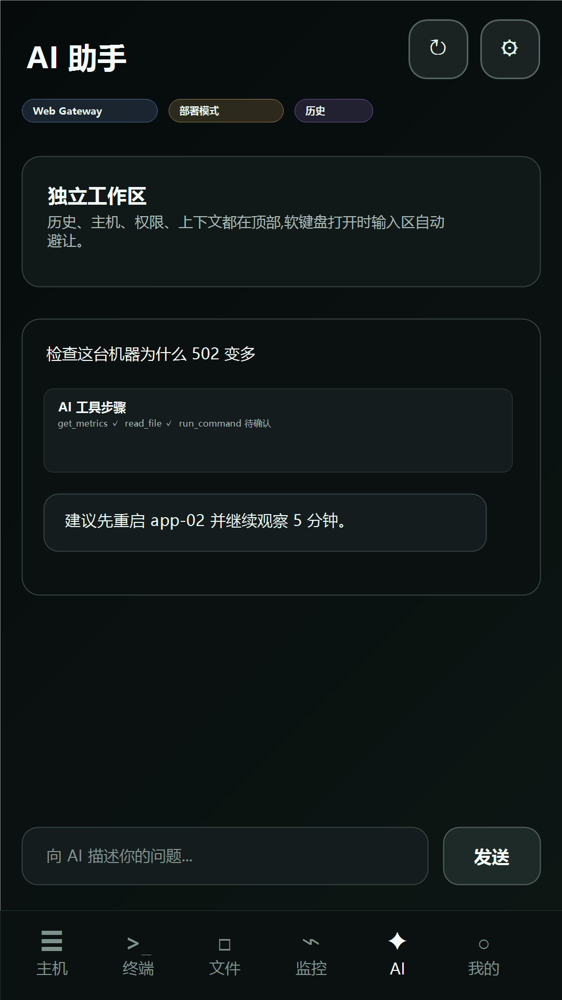

选择目标主机、模型和权限档后与 AI 对话，并管理上下文、历史和设置。截图展示真实只读权限问答，工具执行仍受权限与确认控制。

### Windows 与 Linux 桌面

Windows 提供下列完整桌面入口，Linux 也提供独立桌面客户端；两端共享主机硬删除与生命周期隔离语义。

| 页面 | 能做什么 |
| --- | --- |
| 主机管理 | 分组、收藏、搜索、凭据选择，以及 agent 部署、修复和状态查看 |
| AI 助手 | 结合已授权的主机上下文读取指标、日志和文件并执行工具；桌面支持独立 AI 窗口 |
| 终端 | tmux 持久化终端与普通 SSH PTY 双模式，断线或换设备后可恢复持久化窗口；支持打开多个独立终端窗口并行操作 |
| 监控 | 跨主机健康概览、单机实时详情和历史范围查询 |
| 文件 | 远端文件管理、在线编辑、分块传输、断点续传和完整性校验 |
| 端口映射 | SSH 本地转发；默认监听 `127.0.0.1`，可保存、启动和停止映射 |
| 命令片段 | 保存常用命令并对多台主机执行，结果按主机分组 |
| 系统管理 | 系统信息、进程、防火墙端口和 SSH 密码管理 |
| 应用中心 | 安装 Docker，部署 Nginx/Redis 等应用，管理容器、镜像与 systemd 服务 |
| 访问授权 | 查看本地保险库、SSH key、一次性授权和 AI 审计记录 |
| 设置 | AI provider、语言、外观、本地登录、监控采集与更新检查 |

### 桌面产品截图

Windows 与 Linux 使用同一套桌面交互；以下每张截图都对应一段功能说明，并已完成脱敏核对。

#### 主机管理

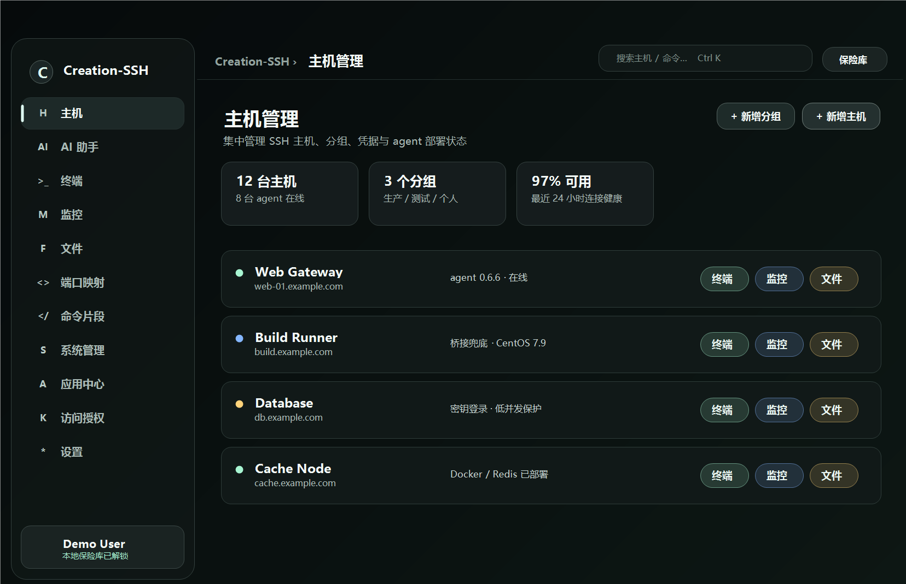

通过分组、收藏和搜索统一管理 SSH 主机，并查看 agent 部署状态与运行指标。删除操作会清除该主机可归属的本地凭据、历史会话、窗口持久化和监控缓存，而不让后续新建主机继承旧数据。

#### 持久化与普通终端

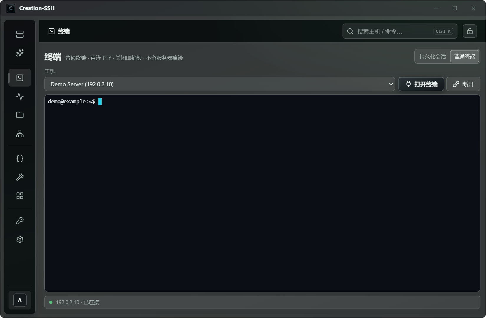

选择主机后，可在 tmux 持久化会话与普通 SSH PTY 之间切换。普通终端在菜单往返期间保留现场，持久化窗口则可在断线或更换设备后重新附加；独立窗口入口可用于并行操作多个终端。

#### 跨主机监控概览

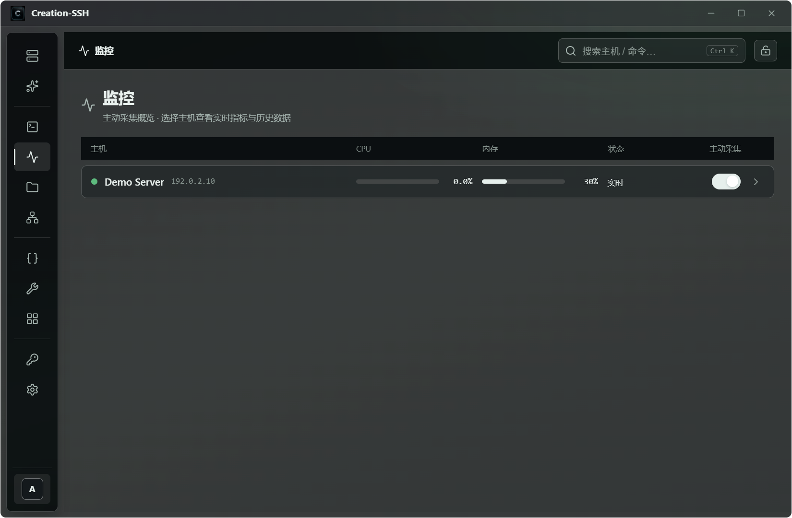

在统一列表中比较多台主机的 CPU、内存与实时状态，并控制主动采集。点击任意主机即可进入对应的监控详情。

#### 单机监控详情

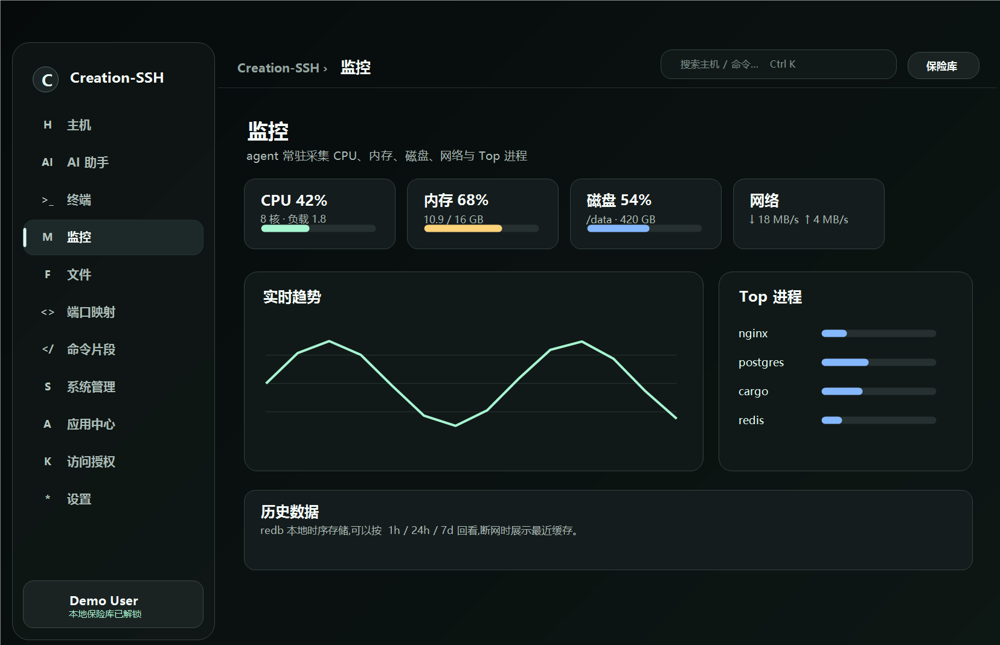

查看单台主机的 CPU、内存、磁盘、Swap、负载、网络和磁盘 I/O。趋势图用于观察近期指标变化，Top 进程帮助定位资源占用来源。

#### 文件管理

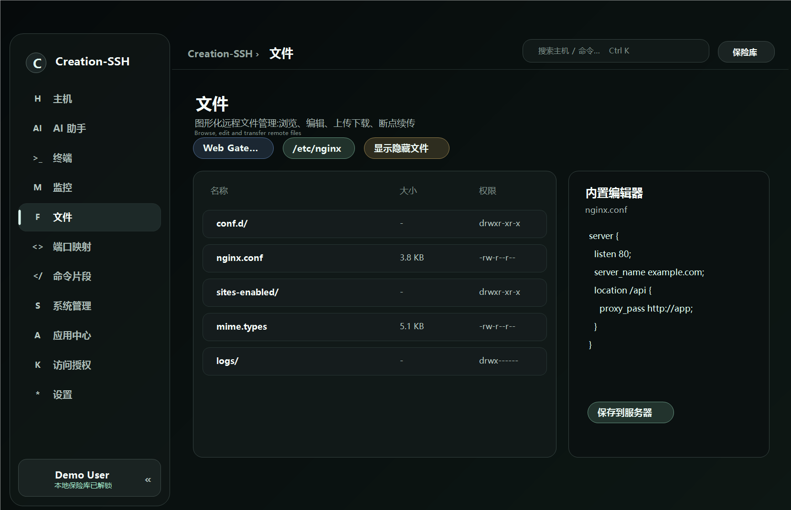

浏览和搜索远端目录，显示隐藏文件，并执行新建、上传、下载、编辑和刷新。文件列表提供大小、修改时间以及逐项操作入口。

#### AI 助手

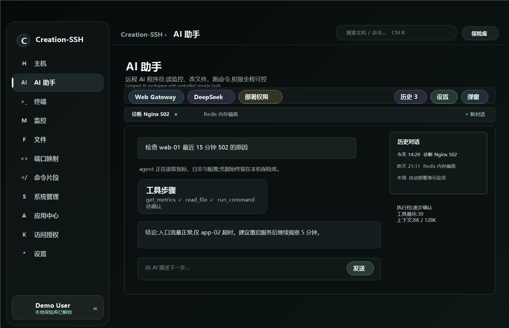

选择主机、模型和权限档，让 AI 在明确授权范围内读取指标与系统信息并给出结果。页面同时提供历史记录、上下文配置和独立 AI 窗口入口。

#### 命令片段

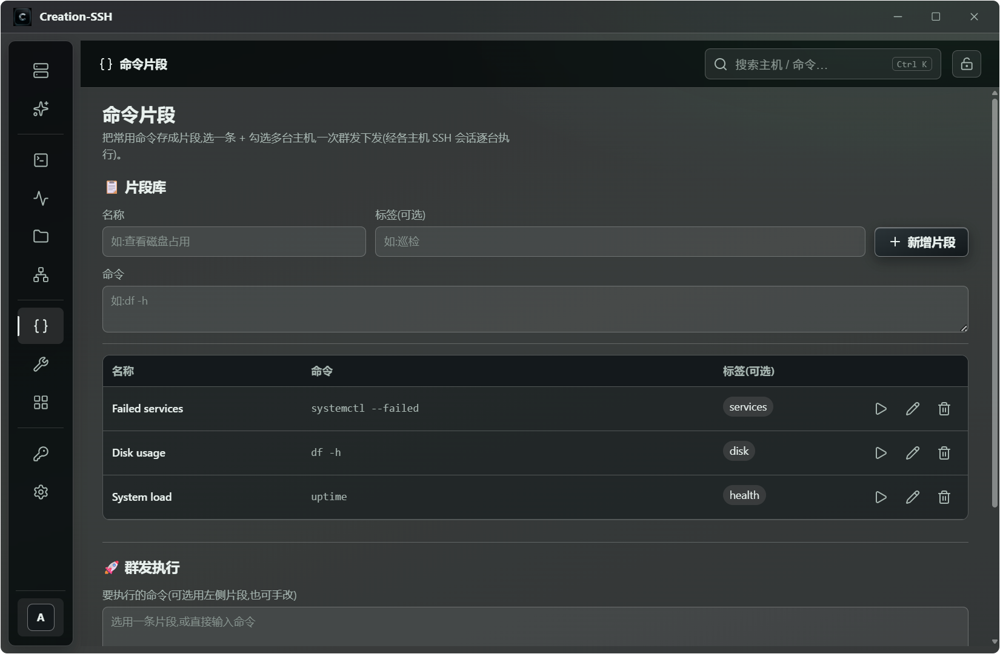

把常用命令保存为带名称与标签的片段，避免重复输入。执行时可选择多台主机，一次下发并按主机查看结果。

#### 访问授权

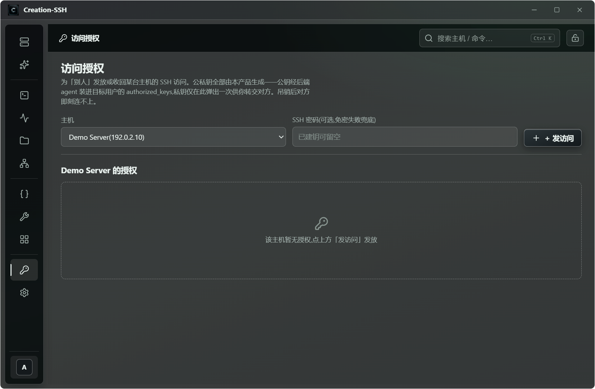

为指定主机生成独立的临时 SSH 访问密钥，私钥只在创建时展示给接收方。授权记录可随时吊销，避免共享主机长期凭据。

#### 设置

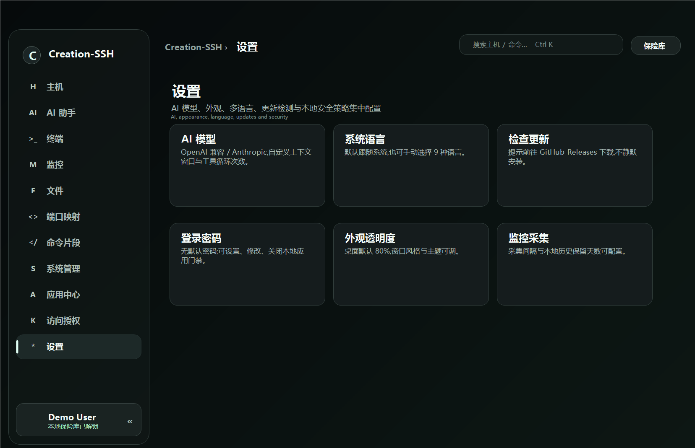

集中配置跟随系统语言、本地登录与保险库密码、AI provider、外观和监控采集。关于页面提供当前版本与更新检查，所有持久设置保存在本地。

## 安全边界

- 私钥和密码只保存在当前设备的本地加密保险库，不上传服务器或 C-SSH 云端；本项目没有托管凭据云服务。
- agent 通过 SSH 隧道访问并只监听服务器本机 Unix socket，不额外暴露公网端口；agent 以当前 SSH 登录身份执行，不自行提权。
- 主机密钥异常会停止连接，破坏性操作需要明确确认；不可达主机只有在远端清理尚未开始时才允许只做本地硬删除，一旦涉及远端状态，无法证明归属或完整清理就会 fail-closed。
- 端口映射默认绑定 `127.0.0.1`。如手动改为其他监听地址，局域网暴露风险由用户自行评估。
- AI 工具受权限档和执行确认约束；使用第三方 AI provider 时，用户选定的对话与上下文会按该 provider 的服务条款处理。

## 免费、语言与开源计划

Creation-SSH 当前永久免费，不设订阅、会员或付费功能锁；界面内置简体中文、繁體中文、English、Español、Français、Deutsch、Português、Русский、한국어。

**当前版本尚未开源。** 本仓库只用于项目介绍、截图与 Release 资产分发。计划是在 iOS 与 macOS 正式版发布后公开源代码；这是后续计划，不代表当前仓库已包含源码，也不承诺具体日期。

## 联系

- 微信：`suiyue_creation`
- QQ 群【AI 创新社区】：[点击加入](https://qm.qq.com/q/OWYQ9hwFWy)

### QQ 群【AI 创新社区】

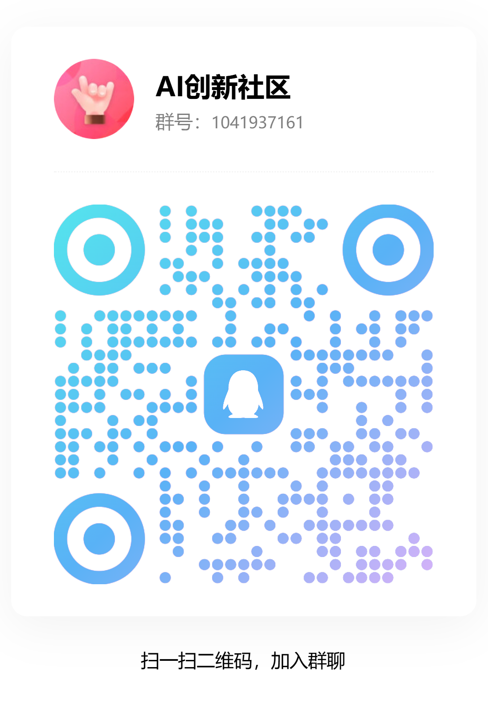

扫描二维码或点击上方链接加入交流群，群号：`1041937161`。这里用于交流使用体验、问题反馈和后续版本计划。
