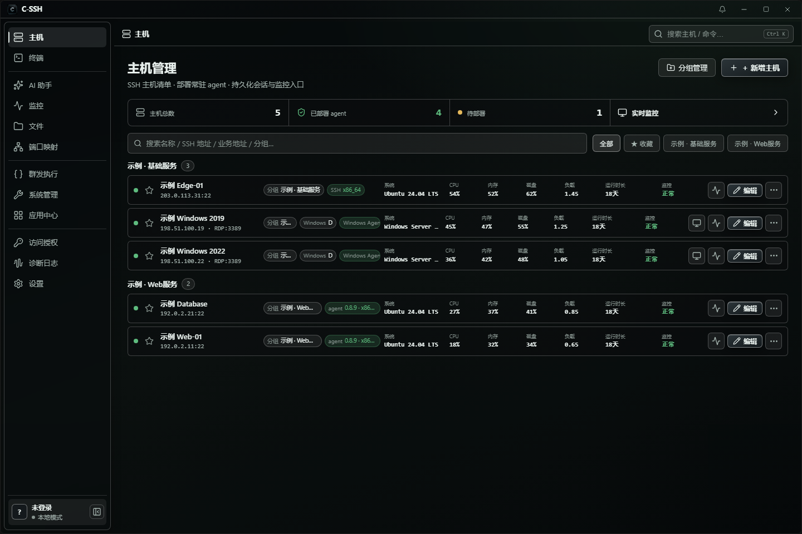
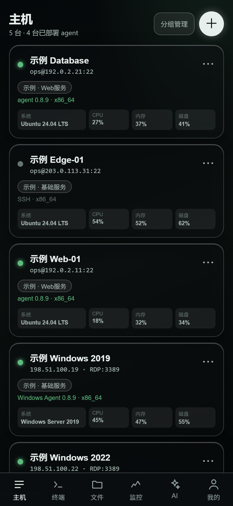
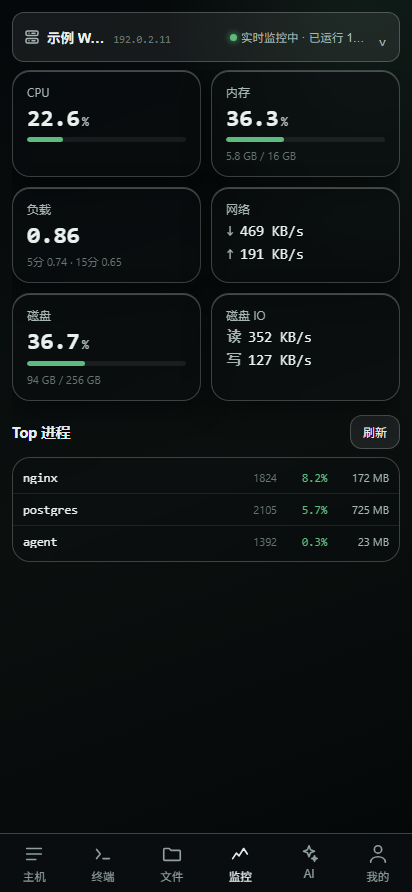
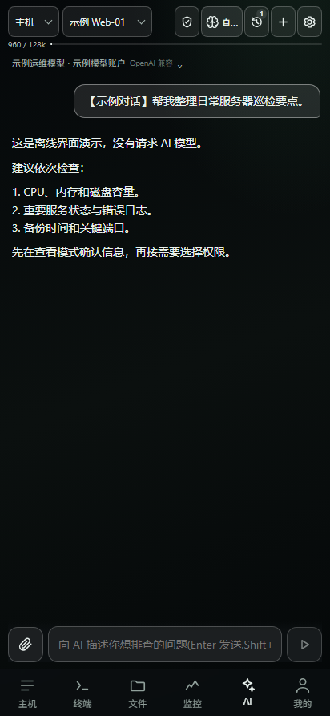

**中文** | [English](README_EN.md)

# C-SSH

Windows 与 Android 上的服务器运维工具：终端、远程桌面、监控、文件管理和 AI 助手。

**0.8.9 功能与界面预览，程序尚未上传。** 本次更新说明和截图；现有公开下载仍为 [v0.8.8](https://github.com/suiyuebaobao/C-SSH/releases/tag/v0.8.8)，下述 0.8.9 新功能不代表旧安装包已经具备。

## 0.8.9 新变化

- **Windows 管理自动安装，也保留手动安装。** 使用已提供的 Windows 登录凭据建立 RDP 连接，自动投放并启动本产品 Setup；需要时识别并确认本产品 UAC，再检查实际管理员权限与安装结果。也可手动导出、运行 Setup，或接管当前远程桌面继续操作。
- **一套 Windows 访问流程。** 支持仅 RDP、OpenSSH 直连和通过 RDP 通道访问 SSH。已保存的密码可复用，避免安装过程中反复填写。
- **PC 与 Android 共用安装逻辑。** Windows 监控、远程桌面、终端、文件与 Native AI 能力进入相应客户端；Windows 终端不提供 Linux tmux 持久会话。
- **检查失败时保留本地使用。** 版本缓存访问失败改为非阻断提示与重试入口；已知的强制更新或停用规则仍有效。确实无法读取的业务数据会单独报错，不清空或新建空库替代原数据。
- **更稳妥的数据与连接处理。** 修复 Android 数据库路径不一致，保留升级前数据；改进主机凭据复用、代理线路、Windows 磁盘／网络指标与加密同步。

## 完整界面图集

**共55张当前界面：**[Windows · 31张](screenshots/WINDOWS.md) · [Android · 24张](screenshots/ANDROID.md) · [图集目录](screenshots/README.md)。

覆盖主机、自动／手动安装、RDP入口、终端、文件、监控、AI三作用域、代理线路、账号／同步、设置等主要页面；原v0.7.5旧图已替换。

图片使用当前0.8.9产品界面与离线示例数据。安装图复用已保存的PC／MuMu界面，其余为后台浏览器渲染，不是新一轮真机或真实服务器验收。

<table>
<tr><th>Android · 主机</th><th>Android · 监控</th><th>Android · AI</th></tr>
<tr><td></td><td></td><td></td></tr>
</table>

## 日常使用

| 能力 | 说明 |
| --- | --- |
| Linux 服务器 | Agent 模式提供 tmux 持久终端、监控和文件能力；普通 SSH 模式可直接使用 PTY、SFTP 与相应运维工具 |
| Windows 服务器 | 0.8.9 候选提供 RDP 与独立 Windows Agent 管理，可选择自动或手动安装 |
| AI 助手 | 多 provider 与模型绑定，支持全局／项目／主机作用域及查看／编辑／全权权限；对话与记忆留在本机 |
| 连接线路 | 0.8.9 候选统一管理直连、SOCKS5、HTTP CONNECT 与显式选择的官方代理；代理失败不自动改为直连 |
| 可选 Cloud | 账号、设备和用户主动发起的加密同步；Cloud 不处于客户端到 Agent 的直接数据链路 |
| 本地数据 | Windows 使用程序旁的 data，Android 使用应用私有目录；删除主机只清本机关联数据 |

## 已验证范围

- Windows Server 2022 的真实 UAC、真实 Windows Server 2019 的安装与权限检查已有定向证据；自动与手动入口均保留。
- Windows 已完成公开 0.8.8 升级链、数据保留及本地模式故障验证；各项测试绑定当时制品，未把不同候选合并成一次全量测试。
- Android 使用 MuMu，已完成相关安装流程、真实旧库迁移、普通启动与本地增删。**没有物理 Android 手机验收结果。**
- 这些结果不保证其它 Windows 策略、UAC 提示语言、缩放或设备组合全部无人值守成功。

## 现有下载

0.8.9 暂不提供下载。下面保留 0.8.8 的原始下载入口与摘要；不会把旧文件换成新程序。

| 平台 | 现有 v0.8.8 下载 |
| --- | --- |
| Windows x64 | [NSIS 安装包](https://github.com/suiyuebaobao/C-SSH/releases/download/v0.8.8/C-SSH_0.8.8_x64-setup.exe) · [便携 ZIP](https://github.com/suiyuebaobao/C-SSH/releases/download/v0.8.8/C-SSH_0.8.8_portable-Windows-x64.zip) |
| Android arm64 | [APK](https://github.com/suiyuebaobao/C-SSH/releases/download/v0.8.8/C-SSH_0.8.8_android-arm64.apk) |
| macOS 13+ Universal | [TEST-UNVERIFIED DMG](https://github.com/suiyuebaobao/C-SSH/releases/download/v0.8.8/C-SSH_0.8.8_macOS-universal_TEST-UNVERIFIED.dmg) · [TEST-UNVERIFIED .app.zip](https://github.com/suiyuebaobao/C-SSH/releases/download/v0.8.8/C-SSH_0.8.8_macOS-universal_TEST-UNVERIFIED.app.zip) |

Windows 0.8.8 安装器没有 Authenticode 签名，系统可能提示未知发布者。0.8.7 及更早 Windows 版本须先手动安装一次 0.8.8，之后才使用现行更新信任根。macOS 测试包使用 ad-hoc 签名，未经真实 Mac 验收或公证，不属于正式客户端发布，也不支持自动更新。

### 0.8.8 SHA256

- `FF15C6CD40D3FC6725A413BD7253AABC191BD76C78CD3AFF83AA255758907736`  `C-SSH_0.8.8_x64-setup.exe`
- `55B42F281725D3995B9117C85A9E688F51AD4F2359D2921768C52E6AB027FAA0`  `C-SSH_0.8.8_portable-Windows-x64.zip`
- `A2C98E7A81BB4E5A66B38A2C8096FE41951AC8B66DD3DFE9AA4C64E17A1E4F80`  `C-SSH_0.8.8_android-arm64.apk`
- `E150EA982F65E458539A7DF2A4E8E45B12B12CAAD0D1CD57DEB5AA785CAD4FA3`  `C-SSH_0.8.8_macOS-universal_TEST-UNVERIFIED.dmg`
- `6359C20F6D9F70C8DAA1E825972597FA4CC7BF40C08869A5B7166F7F85976403`  `C-SSH_0.8.8_macOS-universal_TEST-UNVERIFIED.app.zip`

正式客户端平台为 Windows 与 Android；Windows 采用 NSIS／便携 ZIP，Android 采用 arm64 APK。macOS 仅有上述公开测试包，iOS 尚未发布；Linux 客户端冻结，服务器侧 Linux Agent 继续独立维护。

## 数据与源码边界

- 本机凭据受本机密钥保护；仅在用户主动同步时上传账号密钥加密的密文。Cloud 无法读取主机凭据和 AI provider 密钥。
- AI 执行受所选权限和确认约束；使用第三方模型时，选定上下文会发送给该 provider。
- 本仓库包含产品说明、截图、历史下载及 Creation Cloud 服务端源码镜像；**客户端、共享核心与 Agent 源码尚未公开**。后续开源计划不构成当前源码已公开的声明或日期承诺。

## 语言与联系

C-SSH 当前免费，提供简体中文、繁體中文、English、Español、Français、Deutsch、Português、Русский、한국어。

- 微信：suiyue_creation
- QQ 群【AI 创新社区】：[点击加入](https://qm.qq.com/q/OWYQ9hwFWy)，群号 1041937161
- [更新记录](CHANGELOG.md) · [已有 Release](https://github.com/suiyuebaobao/C-SSH/releases)

