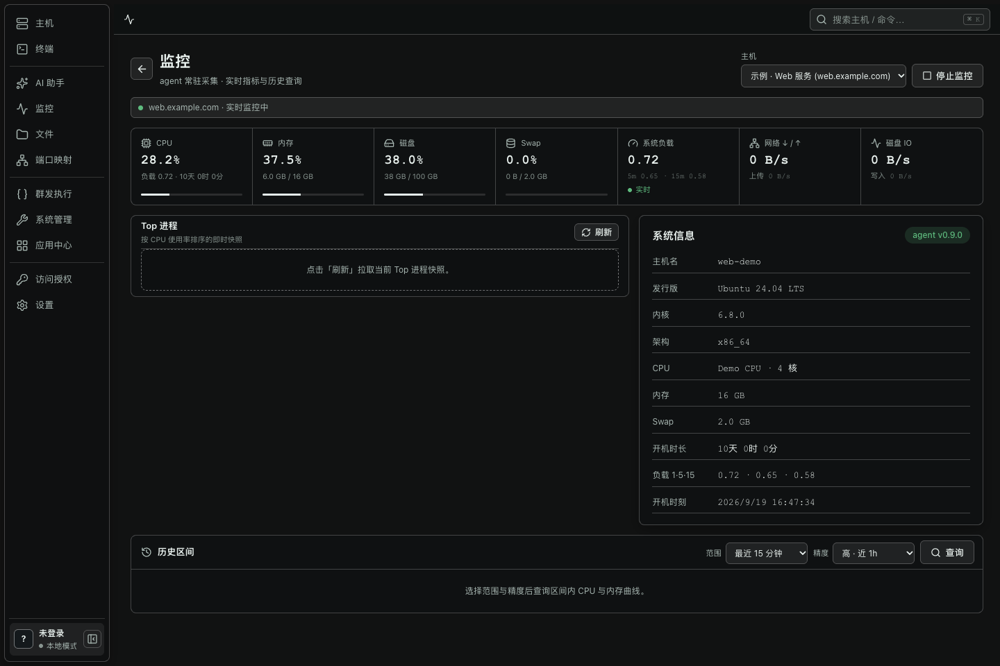

**中文** | [English](README_EN.md)

# C-SSH 0.9.2

面向 **Windows、M系列 Mac、Android 和 Linux** 的服务器运维工作台：主机管理、持久终端、RDP、监控、文件和三作用域 AI。无需登录 Cloud 也能使用本地功能。

> **0.9.2 只通过公告告知，请自行下载并安装；不弹升级提醒、不强制更新。**
>
> Android 沿用 0.9.0 安装签名，可覆盖 0.9.0／0.9.1；更早的旧正式签名不能直接覆盖，卸载会清除本地数据。请先阅读[安装与数据保全说明](INSTALL.md)，尤其注意 AI 对话和记忆不参与 Cloud 同步。Mac 仅支持 M 系列，DMG 采用 ad-hoc 签名且未公证。

## 下载

| 平台 | 0.9.2 官方下载 |
|---|---|
| Windows x64 · NSIS | [C-SSH_0.9.2_x64-setup.exe](https://github.com/suiyuebaobao/C-SSH/releases/download/v0.9.2/C-SSH_0.9.2_x64-setup.exe) |
| Windows x64 · Portable | [C-SSH_0.9.2_portable-Windows-x64.zip](https://github.com/suiyuebaobao/C-SSH/releases/download/v0.9.2/C-SSH_0.9.2_portable-Windows-x64.zip) |
| macOS · Apple Silicon | [C-SSH_0.9.2_macOS-arm64.dmg](https://github.com/suiyuebaobao/C-SSH/releases/download/v0.9.2/C-SSH_0.9.2_macOS-arm64.dmg) |
| Android · arm64 | [C-SSH_0.9.2_android-arm64.apk](https://github.com/suiyuebaobao/C-SSH/releases/download/v0.9.2/C-SSH_0.9.2_android-arm64.apk) |
| Windows 11 ARM64 · NSIS | [C-SSH_0.9.2_arm64-setup.exe](https://github.com/suiyuebaobao/C-SSH/releases/download/v0.9.2/C-SSH_0.9.2_arm64-setup.exe) |
| Windows 11 ARM64 · Portable | [C-SSH_0.9.2_portable-Windows-arm64.zip](https://github.com/suiyuebaobao/C-SSH/releases/download/v0.9.2/C-SSH_0.9.2_portable-Windows-arm64.zip) |
| Linux x86_64 · deb | [C-SSH_0.9.2_amd64.deb](https://github.com/suiyuebaobao/C-SSH/releases/download/v0.9.2/C-SSH_0.9.2_amd64.deb) |
| Linux x86_64 · AppImage | [C-SSH_0.9.2_amd64.AppImage](https://github.com/suiyuebaobao/C-SSH/releases/download/v0.9.2/C-SSH_0.9.2_amd64.AppImage) |
| Linux ARM64 · deb | [C-SSH_0.9.2_arm64.deb](https://github.com/suiyuebaobao/C-SSH/releases/download/v0.9.2/C-SSH_0.9.2_arm64.deb) |
| Linux ARM64 · AppImage | [C-SSH_0.9.2_aarch64.AppImage](https://github.com/suiyuebaobao/C-SSH/releases/download/v0.9.2/C-SSH_0.9.2_aarch64.AppImage) |

[官网](https://c-ssh.com) · [官网下载页](https://c-ssh.com/downloads) · [本次 Release](https://github.com/suiyuebaobao/C-SSH/releases/tag/v0.9.2) · [安装说明](INSTALL.md)

iOS 本次不上传；不提供 Intel Mac、MSI、AAB 或 x86 Android 发布包。Windows 需要可用的 WebView2 Runtime；Mac 最低系统目标为 macOS 13，Android 最低系统目标为 Android 7.0/API 24。最低目标不等于所有系统都已实测。

## 这次更新了什么

- **Linux 桌面客户端**：新增 x86_64／ARM64 的 deb 和 AppImage，复用桌面主机、SSH／Agent、持久终端、RDP／DVC、监控、文件、AI、代理、端口映射和群发能力。
- **Windows ARM64 原生版**：提供 NSIS 和 Portable，已在 Windows 11 ARM64 的普通用户环境验证；远端 Windows 管理组件继续使用 x64。
- **Windows 旧系统终端**：配套 psmux 增加 WinPTY 后端，供缺少 ConPTY 的 Server 2016 使用；现代 Windows 保持 ConPTY。管理组件使用静态 CRT，减少干净系统上的运行库依赖。
- **稳定性修复**：主机编辑／删除等待、Windows 域名接入、文件覆盖权限收尾及 Linux 旧库迁移。
- **公告更简洁**：移除公告界面的同步消息列表，云同步功能保留。
- **手动下载安装**：本次通过公告告知，不弹升级提醒、不强制更新。

[完整更新记录](CHANGELOG.md)

## 完整能力

| 模块 | 能做什么 |
|---|---|
| 主机与项目 | 新增、编辑、搜索、收藏、分组；IPv4/域名、独立端口、密码/私钥和显式代理线路 |
| SSH 与 Agent | 按主机选择普通 SSH 或 Agent 模式；身份、能力及错误由共享运行时处理 |
| 终端 | Linux tmux、Windows Terminal2/psmux 持久终端及普通 SSH；桌面多标签、移动端输入与会话恢复 |
| Windows RDP | 远程桌面及 RDP 内的 DVC 管理通道；证书与账号验证，登录完成后才开放管理连接 |
| 监控 | CPU、内存、磁盘、负载、网络和磁盘 IO、实时/历史曲线、Top 进程与采集设置 |
| 文件 | 浏览、上传、下载、创建、重命名、删除、文本编辑和摘要校验；手机系统文件选择器 |
| AI | 全局/项目/主机作用域，多模型账户与绑定、权限模式、确认、停止、历史及本地记忆 |
| 系统与应用 | 系统信息、进程、防火墙、服务；桌面应用中心按服务器能力管理 Docker/systemd/Windows 服务 |
| 桌面工具 | Windows/Mac/Linux 的端口映射、命令库、群发执行、逐机结果及访问授权 |
| 代理 | 直连、保存的 SOCKS5/HTTP CONNECT 线路及显式官方代理；代理失败不自动直连 |
| Cloud | 可选登录、设备管理、主机/代理/模型账户的手动端到端加密同步；官方或自建服务 |
| 偏好与诊断 | 九种语言、外观、采集参数、数据保护设置；诊断日志默认关闭 |

[逐项功能与平台差异](FEATURES.md) · [自建云接入与更新](SELF_HOSTING.md) · [完整截图目录](screenshots/README.md)

## 界面图集

[Windows](screenshots/WINDOWS.md) · [Mac](screenshots/MACOS.md) · [Android](screenshots/ANDROID.md)

[0.9.1 新增入口](screenshots/v0.9.1/README.md)与保留的 0.9.0 完整图集均使用真实 Vue 界面及合成示例数据，在后台浏览器中渲染。它展示界面，不冒充原生程序、真机或真实服务器验收；个人联系方式在公开截图中隐藏。

## 验证范围

- Windows x64／ARM64：普通用户隔离环境的 NSIS／Portable、安装启动卸载及 0.9.1 到 0.9.2 手动升级与 data 保留；ARM64另有真实SSH、文件传输、tmux、Server2022 RDP／DVC及Terminal2重连证据。
- Mac：arm64、DMG挂载、版本、内嵌资源与完整ad-hoc签名通过；未公证，不外推最低系统或全部M系列机型。
- Android：包名、版本、ABI、原签名、16KiB对齐与资源检查；SDK Emulator覆盖0.9.1后启动与设置保留，不代表物理手机验收。
- Linux：Ubuntu24.04.5的ARM64与x86_64隔离VM，实际deb与AppImage启动、系统密钥环、冷恢复及桌面功能分项验证。Wayland和其它发行版尚未验收；无GPU的Xvfb夹具使用了仅作用于测试环境的WebKit图形设置。
- Server2016的WinPTY产品接入已有开发候选实链；本次0.9.2 Setup另在本机Server2022验证。Issue57原安装错误46未复现，不宣称已修复。首次监控请求及紧接detach的关闭拒绝保留为观察记录，后续成功不等于根因已修复。

## 数据与源码

Cloud 不转发客户端到服务器的 SSH 数据。主机凭据和模型 Key 在客户端加密后才进入手动同步；AI 对话和记忆留在本机。使用模型服务时，选定上下文会发送给该服务商。删除本地主机只处理本机数据，不卸载远端 Agent 或清理远端会话。

本公开仓提供推广资料、截图、安装包及筛选后的 Creation Cloud 生产源码镜像；客户端、共享核心、AI 与 Agent 源码未公开。

## SHA256

- `eb55cf041a5c430ceb9264e278f54c889436322db0e4fffacfcf46bca45b818a`  `C-SSH_0.9.2_android-arm64.apk`
- `c20223ed8751abe9f8484672eb5c589d8c51c4f21fb9ec7dfb8c116ab01316fa`  `C-SSH_0.9.2_aarch64.AppImage`
- `34a2d102a3934a2cbbf013c5eca364381d9b8eab20a714fd0b2315543e081e51`  `C-SSH_0.9.2_amd64.AppImage`
- `13be972dcfc6bf860e3b587237493f4dca4b0b7df909b8976db7539780031142`  `C-SSH_0.9.2_amd64.deb`
- `287d2a4c0c193f9b9e1d9ea4c352b11b40b93ec32018d0eb88ec4a07cba630b9`  `C-SSH_0.9.2_arm64.deb`
- `4c12425965724d76f004b9d7bfe8744d6c56cc81d859ad906c0a2618af7a50b1`  `C-SSH_0.9.2_macOS-arm64.dmg`
- `0f72009dfd5b91b70e699d7ce29f13b329ed929b2bb1f2b8e57f1baf1912772c`  `C-SSH_0.9.2_arm64-setup.exe`
- `b9d9f0b148615d00b2d438039125857b22412b4cf4cf09395efa2fb27aaea0e3`  `C-SSH_0.9.2_portable-Windows-arm64.zip`
- `9e635e857025732e3e68fcced78ab983a1c735c0a322c7aaccb539f3f6743b4b`  `C-SSH_0.9.2_portable-Windows-x64.zip`
- `447a880a1e3c7a5841907e1247a6e48a832c7e5e36704f18a67f27eed437fb38`  `C-SSH_0.9.2_x64-setup.exe`

## 反馈与联系

- [GitHub Issues](https://github.com/suiyuebaobao/C-SSH/issues) · [官网反馈](https://c-ssh.com/feedback)
- QQ 群【AI 创新社区】：[点击加入](https://qm.qq.com/q/OWYQ9hwFWy)，群号 1041937161
- 支持简体中文、繁體中文、English、Español、Français、Deutsch、Português、Русский、한국어。

旧版 Release、安装包及摘要保持原样，见[历史发布](https://github.com/suiyuebaobao/C-SSH/releases)。
