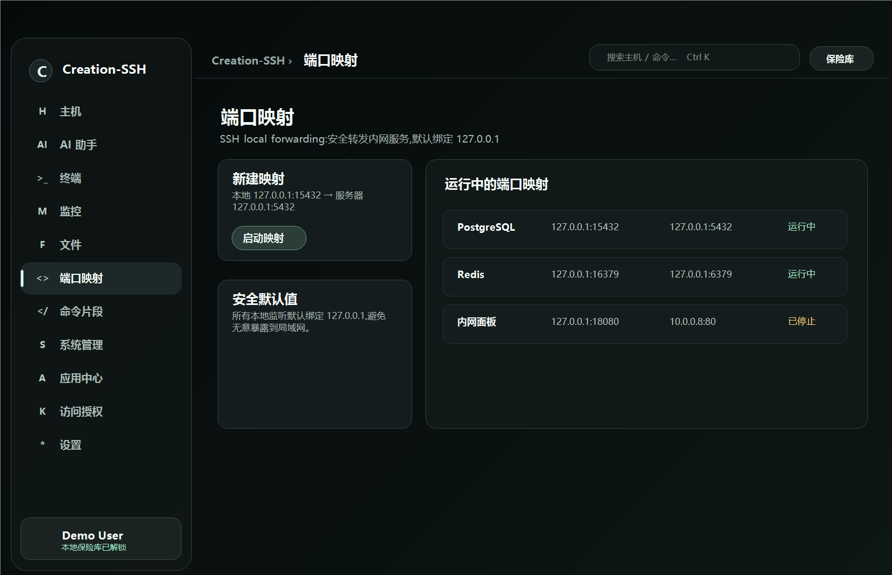
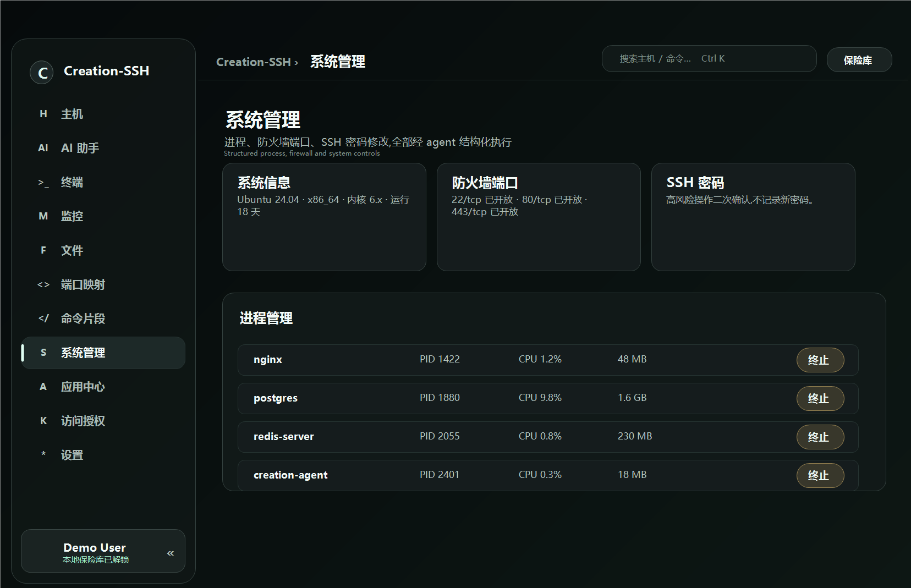
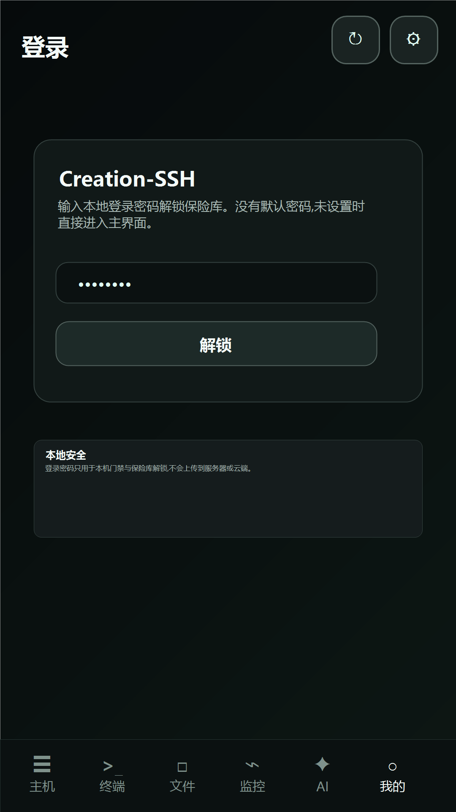
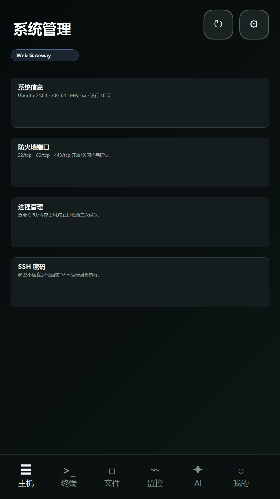

[中文](README.md) | **English**

# Creation-SSH (C-SSH)

### A new cross-platform SSH operations experience: native client, server-side tmux persistence, always-on monitoring, and a built-in AI assistant

---

## What Is It

Creation-SSH is not another web ops panel, and it is not just a plain SSH terminal. It combines the native feel of tools like Xshell, structured capabilities from an always-on server-side agent, and tmux-grade persistent terminal sessions.

In one line: **native client + structured resident agent + persistent sessions**, a modern three-in-one SSH operations tool.

---

## Desktop Page Guide

> Screenshots below use sanitized demo data such as `example.com`; they do not include real servers or credentials.

### Host Management

The home page manages SSH hosts, groups, favorites, search, agent deployment, and repair. Host creation supports password or OpenSSH private-key authentication, and credentials stay in the local encrypted vault.

### AI Assistant

The AI assistant works with host context: it can read metrics, inspect logs, edit files, and run commands under explicit permission modes. The top workspace keeps history, host selection, permissions, context usage, and performance presets close at hand; the desktop app also supports an independent AI pop-out window.

### Terminal

In **persistent mode**, the agent drives tmux directly. After a disconnect, reboot, or device switch, reconnecting restores the full screen through `capture-pane`, so running tasks stay alive. **Direct mode** is a native PTY fallback that works even without the agent.

### Monitoring Overview

The monitoring overview shows health across all hosts before you drill into one machine. It is designed for quick daily checks: online state, load, warnings, and recent cached status are visible without opening a terminal.

### Monitoring Detail

The resident agent continuously samples CPU, memory, disk, network, disk I/O, and top processes. Live cards show current state, while historical data is stored in redb for time-range review.

### File Manager

Browse remote files graphically with create, read, update, delete, online editing, permission viewing, chunked transfers, and resumable upload/download. File operations are provided by the agent in a structured way instead of being stitched together from shell commands.

### Port Forwarding

Port forwarding uses SSH local forwarding to expose remote internal services safely on your machine. Local listeners bind to `127.0.0.1` by default to avoid accidental LAN exposure, and saved forwards can be rebuilt, stopped, or removed.

### Command Snippets

Command snippets turn repeated operations into a local command library. Select multiple hosts, run a snippet, and review grouped results per host.

### System Management

System management covers read-only system facts, process control, firewall ports, and SSH password changes. Destructive actions require confirmation and run as the SSH login user without extra privilege escalation.

### App Center

Install Docker itself in one click, deploy common containerized apps such as Nginx and Redis, and manage Docker containers, images, and systemd services. Destructive actions require confirmation and run as the SSH login user.

### Access Grants

Access grants centralize the local vault, generated SSH keys, one-time authorization, and AI audit records. Credentials stay on the local device and are never uploaded.

### Settings

Settings collect AI provider configuration, custom context windows, tool-loop limits, system-language following, login password, desktop transparency, monitoring collection, and GitHub update checks.

---

## Mobile Page Guide (Android)

Desktop power in your pocket. The same persistent tmux sessions, monitoring, file management, and built-in AI assistant are available from Android.

### Mobile Hosts
The hosts page uses cards for server management, including creation, editing, deletion, agent deployment, and quick jumps into terminal, monitoring, and system management.

### Mobile Terminal
The terminal page keeps both persistent tmux and direct PTY modes, with mobile shortcut keys for Ctrl, Esc, Tab, and arrows.

### Mobile Files
The files page supports directory browsing, editing, downloading into the app sandbox, creating, renaming, deleting, and toggling hidden files.

### Mobile Monitoring
The monitoring page subscribes to live metrics and shows CPU, memory, disk, network, and top process state on a phone-sized layout.

### Mobile AI Assistant
The AI page keeps host selection, permissions, context, history, and configuration in mobile sheets. The input area avoids the soft keyboard so typed text stays visible.

### Mobile System Management
System management opens as an inner page from the host actions and covers system facts, firewall ports, process termination, and SSH password changes.

### Me / Login Gate
The Me page includes language, update checks, version information, login password, and local security settings. If a login password is configured, the app starts at the local login gate to unlock the vault.

## Why C-SSH

- **Native client experience**: full-stack Rust + Tauri 2, fast startup, low resource use, and a desktop-first workflow.
- **Sessions that survive disconnects**: the agent drives tmux directly, so reconnecting restores long-running work.
- **Structured resident agent**: monitoring, files, apps, and system management are delivered by a server-side agent, not by fragile client-side shell stitching.
- **Built-in AI with two API families**: OpenAI-compatible APIs and Anthropic, with five permission tiers and execution confirmation.
- **Local encrypted credentials**: private keys and passwords stay in the local encrypted vault and are never uploaded.
- **Global by design**: the interface ships with 9 languages.
- **Desktop and mobile**: Windows desktop plus Android companion.

---

## Supported Platforms

| Platform | Status | Notes |
| --- | --- | --- |
| Windows | Supported | Desktop client, setup.exe / MSI / portable zip |
| Android | Supported | Mobile companion, arm64 APK |
| Server agent (Linux) | Supported | x86_64 / ARM64 static musl binary |
| macOS | Planned | Open-source plan starts after both iOS and macOS stable releases |
| iOS | In development | Open-source plan starts after the stable iOS and macOS releases |

---

## Global And Free Forever

Creation-SSH is built for users worldwide, with 9 built-in languages: Simplified Chinese, Traditional Chinese, English, Spanish, French, German, Portuguese, Russian, and Korean.

The product is **free forever**: no subscription, no paid tier, and no locked features.

---

## Open-Source Commitment

**The project will be open-sourced after the stable iOS and macOS releases are published.** We want to bring a genuinely useful native SSH operations tool to the community and maintain it openly for the long term.

---

## Download

Grab the latest build from [**Releases**](../../releases/latest):

**Current latest version**: `v0.6.6`.

- **Windows**: download `Creation-SSH_0.6.6_x64-setup.exe` (recommended) or `Creation-SSH_0.6.6_x64_en-US.msi`.
- **Portable Windows**: download `Creation-SSH_0.6.6_portable-Windows-x64.zip`, unzip it, and run `Creation-SSH.exe`. Keep the bundled `resources` folder next to the executable.
- **Android**: download and install `C-SSH_0.6.6_android-arm64.apk`.

All example configurations use placeholders such as `example.com`; replace them with your own server details.

## v0.6.6 Highlights

- The agent now has a `stdio-bridge` transport fallback, so CentOS 7.9 and other systems that reject `direct-streamlocal` can still use agent-backed features.
- Short agent requests now use Stable / Balanced / Fast / Ultra performance presets and temporarily auto-downgrade after transport failures to reduce high-concurrency crashes.
- The desktop AI assistant can pop out into an independent window, laying the groundwork for operating multiple AI assistant windows side by side.
- Host creation now supports OpenSSH private-key authentication; passwords and keys continue to stay only in the local encrypted vault.
- Windows, Android, agent, public asset names, and app metadata are synchronized to `0.6.6` and verified with signatures, version checks, ABI inspection, and SHA256 hashes.

## Releases And Changelog

- Download the latest installers and read the full release notes in [GitHub Releases](../../releases/latest).
- Historical changes are tracked in [CHANGELOG_EN.md](CHANGELOG_EN.md).
- Release notes are bilingual and include Downloads, Added, Fixed, Verified, and SHA256 sections.

## Contact And Community

- WeChat: **`suiyue_creation`**
- QQ Group (AI Innovation Community): **[Join here](https://qm.qq.com/q/OWYQ9hwFWy)**

 Scan to join the QQ group (AI Innovation Community) - Group No. 1041937161

Questions, feedback, or want to follow iOS / macOS / open-source progress? Come say hi.

---

This repository is used only for public project introduction, screenshots, and release distribution. The source code is not hosted here yet and will be opened according to the commitment above.

