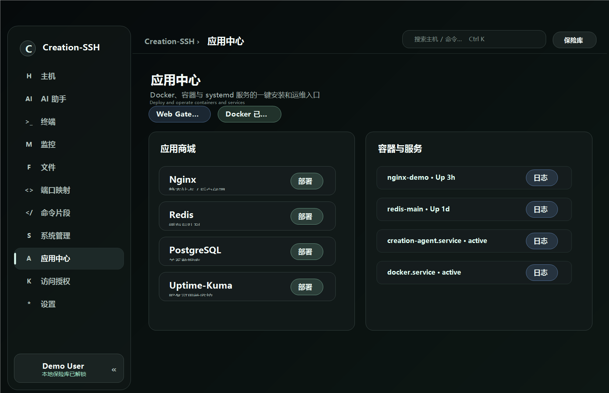
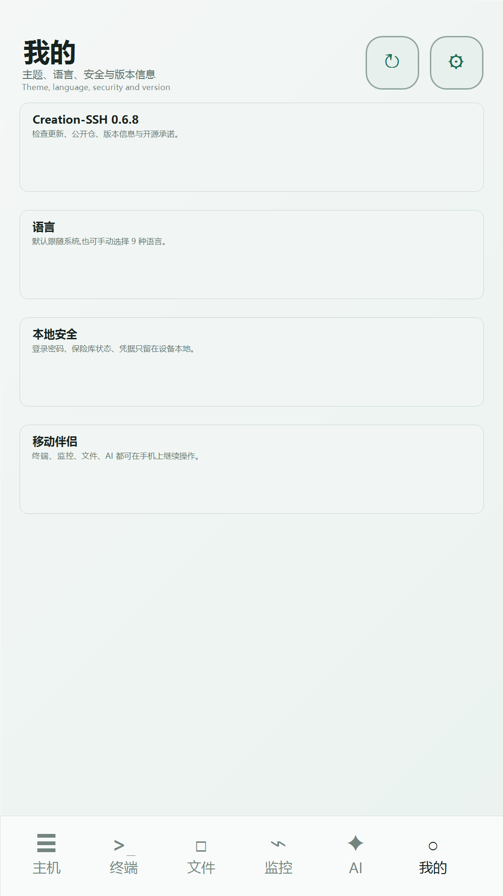

[中文](README.md) | **English**

# Creation-SSH (C-SSH)

### A new way to manage servers over SSH — native client × server-side tmux persistence × always-on monitoring × built-in AI assistant

---

## What is it

Creation-SSH is neither yet another web-based ops panel nor a plain SSH terminal. It combines three things in one: the **native-client feel of tools like Xshell**, the **structured capabilities of an always-on server-side agent**, and **tmux-grade session persistence**. The client stays fast and native, the heavy lifting is handled in a structured way by a resident agent on the server, and your terminal sessions survive disconnects, reboots, and device switches.

In one line: **native client × always-on structured agent × persistent sessions** — a modern SSH ops tool, three-in-one.

---

## Features

### Host management with a lightweight dashboard

Manage all your servers in one place, with a lightweight resource dashboard embedded in the list so you can see each machine's status and load at a glance. Group, search, and connect fast — credentials are encrypted locally and never uploaded.

### Dual-mode terminal (persistent tmux + direct)

In **persistent mode**, the agent drives tmux directly; after a disconnect, reboot, or device switch, reconnecting restores the full screen via `capture-pane` — not a single line of your running task is lost. **Direct mode** is a pure native PTY that works as a plain terminal even without the agent installed. Switch between the two at will.

### Always-on monitoring (six live cards + history)

The resident agent continuously samples six dimensions — CPU, memory, disk, network, disk I/O, and top processes — shown as six live cards. History is stored in a redb time-series database so you can look back over any time range. No monitoring stack to set up; it works the moment you connect.

### File manager (CRUD + editor + resumable transfers)

Browse the remote file system graphically with create/read/update/delete, in-place editing, and permission viewing. Uploads and downloads are chunked and resumable, so even large files stay reliable. File capabilities are provided by the agent in a structured way — no shell-stitching on the client.

### App Center (one-click Docker / systemd)

A built-in app store: install Docker itself in one click, then deploy common containerized apps like Nginx and Redis just as easily. Manage Docker containers and images and systemd services (start/stop, view logs) in a structured way. Destructive actions require confirmation, and everything runs as your SSH login user — never with extra privilege escalation.

### Built-in AI ops / coding assistant

A built-in AI assistant that can read monitoring data, inspect logs, write files, edit configs, and run commands to help you diagnose issues and write scripts. **Five permission tiers plus per-action confirmation** keep every write and execution controllable and auditable. It supports both the **OpenAI-compatible API** and **Anthropic**, so you can pick your own model.

---

## 📱 Mobile companion (Android)

Desktop power, in your pocket. The same persistent tmux sessions, always-on monitoring and built-in AI assistant — continue your ops from anywhere on your phone.

## Why C-SSH

- **Native client experience** — full-stack Rust + Tauri 2: fast to launch, light on resources, not a wrapped web panel, and as smooth to use as Xshell.
- **Sessions that never drop** — the agent drives tmux directly, so reconnecting after a disconnect/reboot/device switch restores everything; long-running tasks are never interrupted.
- **Always-on structured agent** — monitoring, files, apps, and system management are all delivered by a resident server-side agent in a structured, reusable, efficient way — not stitched together from shell on the client.
- **Built-in AI, dual API** — supports both OpenAI-compatible and Anthropic backends, with five permission tiers and execution confirmation: powerful yet safe and controllable.
- **Credentials encrypted locally, zero upload** — private keys and passwords live only in a local encrypted vault, never uploaded to any server or cloud.
- **Global by design** — the interface ships with 9 languages for users everywhere.
- **Desktop and mobile** — a Windows desktop client plus an Android companion; one experience you carry with you.

---

## Supported platforms

| Platform | Status | Notes |
| --- | --- | --- |
| Windows | ✅ Supported | Desktop client (setup.exe / msi) |
| Android | ✅ Supported | Mobile companion (arm64 APK) |
| Server agent (Linux) | ✅ Supported | x86_64 / ARM64, static musl binary, single-file deploy |
| iOS | 🚧 In development | Client in progress — stay tuned |

---

## 🌍 Global · 💛 Free Forever

Creation-SSH is **built for users worldwide**, with **9 languages** built in (Simplified Chinese, Traditional Chinese, English, Spanish, French, German, Portuguese, Russian, Korean) so it feels at home wherever you are.

The product is **free forever** — no subscriptions, no paid tiers, no locked features. 💛

---

## 🔓 Open-source commitment

**At 500 GitHub stars, or once the iOS client ships — whichever comes first — the project goes fully open-source.** Our goal is to bring the community a genuinely great native SSH ops tool and maintain it openly, welcoming contributions for the long haul.

> In other words: if you want it open-sourced sooner, a ⭐ Star is the most direct nudge — 500 stars unlocks it.

---

## 📥 Download

Grab the latest build from [**Releases**](../../releases/latest):

- **Windows**: download `Creation-SSH_x.y.z_x64-setup.exe` (recommended) or the `.msi`.
- **Portable (recommended, no install)**: download `Creation-SSH-portable-Windows-x64.zip`, unzip and run — zero install; it bundles the agent & static tmux, keep the whole folder together.
  - If Windows SmartScreen appears on first launch, click "More info → Run anyway".
- **Android**: download and install `C-SSH-android-arm64.apk`.
  - First install requires enabling "Install unknown apps" in system settings.

> All example configurations use placeholders such as `example.com` — replace them with your own server details.

## 🧾 Releases & changelog

- Download the latest installers and read the full release notes in [GitHub Releases](../../releases/latest).
- Historical changes are tracked in [CHANGELOG_EN.md](CHANGELOG_EN.md).
- Release notes are bilingual and include Added / Fixed / Verified / Downloads sections.

## 💬 Contact · Community

- WeChat: **`suiyue_creation`**
- QQ Group (AI Innovation Community): **[Join here](https://qm.qq.com/q/OWYQ9hwFWy)**

 Scan to join the QQ group (AI Innovation Community) · Group No. 1041937161

Questions, feedback, or want to nudge us on iOS / open-source progress? Come say hi!

---

---

This repository is used only to distribute the project introduction, screenshots, and installers for promotion; the source code is not hosted here yet (it will be fully open-sourced once iOS is ready).

