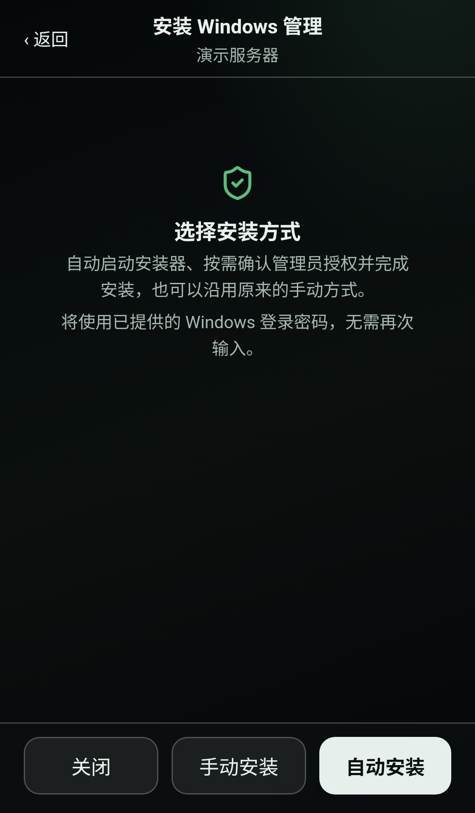
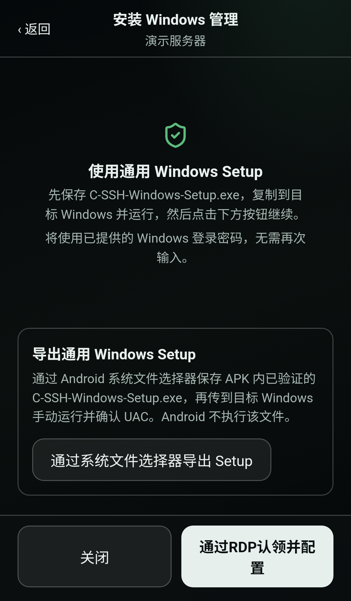
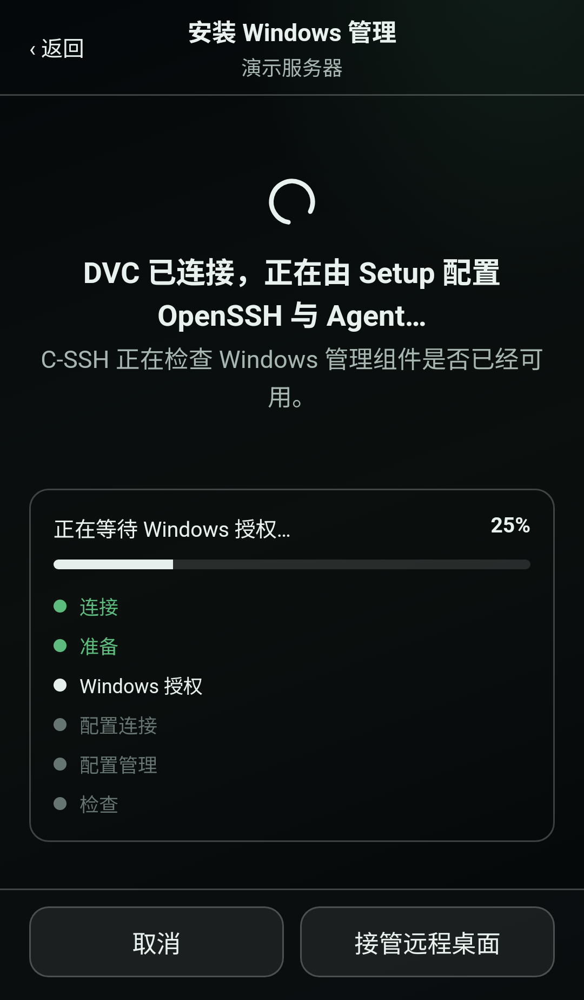

[中文](README.md) | **English**

# C-SSH

Server operations on Windows and Android: terminals, remote desktop, monitoring, files, and an AI assistant.

**0.8.9 feature and interface preview — binaries have not been uploaded.** This update publishes documentation and screenshots. Existing public downloads remain [v0.8.8](https://github.com/suiyuebaobao/C-SSH/releases/tag/v0.8.8); the new features below are not a claim about those older binaries.

## What's New In 0.8.9

- **Automatic Windows management installation, with manual installation retained.** Use the supplied Windows credentials to establish RDP, transfer and launch this product's Setup, recognize and confirm its UAC prompt when needed, then check actual administrator privileges and installation results. Users can also export and run Setup manually or take over the current remote desktop.
- **One Windows access flow.** Choose RDP only, direct OpenSSH, or SSH over the RDP channel. Saved credentials are reused instead of repeatedly requested during installation.
- **Shared installation logic on PC and Android.** Windows monitoring, remote desktop, terminal, file and Native AI capabilities are available in the respective clients. Windows terminals do not provide Linux tmux persistence.
- **Local use remains accessible when checks fail.** Version-cache access failures show a nonblocking notice and retry action. Known mandatory-update or disabled-version decisions remain effective. Unreadable business data reports its own error; the original database is not replaced with an empty one.
- **Improved data and connection handling.** Fixes Android database path inconsistency while preserving upgrade data, and improves credential reuse, proxy profiles, Windows disk/network metrics and encrypted sync.

## Latest Installation Screens

These are 0.8.9 development-client screens captured on September 13, 2026, using a demonstration host name. Windows was captured in an isolated background window; Android used MuMu. The progress image replays an existing state to illustrate the interface and is not a new remote-installation run.

<table>
<tr><th>Android · 自动 / Automatic</th><th>Android · 手动 / Manual</th></tr>
<tr><td></td><td></td></tr>
</table>

Android · 安装进度界面 / Installation progress preview

Automatic installation handles only the product task selected by the user and keeps system UAC settings. When a prompt or result cannot be verified, users can continue manually; other applications are not automatically approved.

## Everyday Work

| Capability | Description |
| --- | --- |
| Linux servers | Agent mode provides persistent tmux terminals, monitoring and files; native SSH mode provides PTY, SFTP and applicable operations tools |
| Windows servers | The 0.8.9 candidate adds RDP and independent Windows Agent management with automatic or manual installation |
| AI assistant | Multiple providers and model bindings; Global, Project and Host scopes with View, Edit and Full Access permissions; conversations and memory stay local |
| Connection routes | The 0.8.9 candidate shares direct, SOCKS5, HTTP CONNECT and explicitly selected official proxy routes; failed proxies do not silently become direct connections |
| Optional Cloud | Accounts, devices and user-initiated encrypted sync; Cloud is outside the direct client-to-Agent data path |
| Local data | Windows uses the adjacent data directory; Android uses its private application directory; deleting a host removes its local associated state |

## Verification Scope

- Targeted evidence covers real UAC on Windows Server 2022 and installation and privilege checks on a real Windows Server 2019 host. Both automatic and manual entry points remain available.
- Windows coverage includes updates from public 0.8.8, data retention and local-mode fault handling. Each result retains its tested artifact identity; separate candidates are not presented as one complete test run.
- Android used MuMu for the relevant installation flow, real legacy-database migration, normal startup and local create/read/delete operations. **No physical Android phone acceptance was performed.**
- This does not guarantee unattended success for every Windows policy, UAC language, scaling level or device combination.

## Existing Downloads

0.8.9 is not available for download yet. The original 0.8.8 links and hashes remain below; old assets are not replaced with new binaries.

| Platform | Existing v0.8.8 downloads |
| --- | --- |
| Windows x64 | [NSIS installer](https://github.com/suiyuebaobao/C-SSH/releases/download/v0.8.8/C-SSH_0.8.8_x64-setup.exe) · [Portable ZIP](https://github.com/suiyuebaobao/C-SSH/releases/download/v0.8.8/C-SSH_0.8.8_portable-Windows-x64.zip) |
| Android arm64 | [APK](https://github.com/suiyuebaobao/C-SSH/releases/download/v0.8.8/C-SSH_0.8.8_android-arm64.apk) |
| macOS 13+ Universal | [TEST-UNVERIFIED DMG](https://github.com/suiyuebaobao/C-SSH/releases/download/v0.8.8/C-SSH_0.8.8_macOS-universal_TEST-UNVERIFIED.dmg) · [TEST-UNVERIFIED .app.zip](https://github.com/suiyuebaobao/C-SSH/releases/download/v0.8.8/C-SSH_0.8.8_macOS-universal_TEST-UNVERIFIED.app.zip) |

The Windows 0.8.8 installer is not Authenticode-signed and may trigger an unknown-publisher prompt. Windows versions 0.8.7 and earlier require one manual installation of 0.8.8 before using the current updater trust root. The macOS test builds use ad-hoc signing, lack notarization and real-Mac acceptance, and are not production client releases or automatically updated.

### 0.8.8 SHA256

- `FF15C6CD40D3FC6725A413BD7253AABC191BD76C78CD3AFF83AA255758907736`  `C-SSH_0.8.8_x64-setup.exe`
- `55B42F281725D3995B9117C85A9E688F51AD4F2359D2921768C52E6AB027FAA0`  `C-SSH_0.8.8_portable-Windows-x64.zip`
- `A2C98E7A81BB4E5A66B38A2C8096FE41951AC8B66DD3DFE9AA4C64E17A1E4F80`  `C-SSH_0.8.8_android-arm64.apk`
- `E150EA982F65E458539A7DF2A4E8E45B12B12CAAD0D1CD57DEB5AA785CAD4FA3`  `C-SSH_0.8.8_macOS-universal_TEST-UNVERIFIED.dmg`
- `6359C20F6D9F70C8DAA1E825972597FA4CC7BF40C08869A5B7166F7F85976403`  `C-SSH_0.8.8_macOS-universal_TEST-UNVERIFIED.app.zip`

Production client platforms are Windows and Android: NSIS/portable ZIP for Windows and an arm64 APK for Android. macOS has only the test downloads above; iOS has not been released. The Linux client is frozen, while the server-side Linux Agent is maintained separately.

## Historical Interface Reference

These v0.7.5 screenshots use offline demonstration data and remain historical references. The 0.8.9 screens above show the new installation flow.

<table>
<tr><td></td><td></td></tr>
<tr><td></td><td></td></tr>
<tr><td></td><td></td></tr>
</table>

## Data And Source Boundaries

- Local credentials are protected by a device-local key. Only user-initiated sync uploads account-key-encrypted ciphertext; Cloud cannot read host credentials or AI-provider secrets.
- AI execution follows the selected permissions and confirmation rules. Selected context is sent to the third-party provider when its models are used.
- This repository contains product documentation, screenshots, historical downloads and a Creation Cloud server-source mirror. **Client, shared-core and Agent source are not public.** Future open-source plans are not a statement that this source is already available or a commitment to a release date.

## Languages And Contact

C-SSH is currently free and provides Simplified Chinese, Traditional Chinese, English, Spanish, French, German, Portuguese, Russian and Korean.

- WeChat: suiyue_creation
- QQ group, AI Innovation Community: [Join here](https://qm.qq.com/q/OWYQ9hwFWy), group 1041937161
- [Changelog](CHANGELOG_EN.md) · [Existing Releases](https://github.com/suiyuebaobao/C-SSH/releases)

