[中文](README.md) | **English**

# Creation-SSH (C-SSH)

### Keep operating from your phone: persistent terminals, monitoring, files, and an AI assistant

Creation-SSH is an SSH operations client for Windows PCs and Android. Android is more than a read-only remote: it manages hosts, restores server-side tmux sessions, shows monitoring data, handles files, runs the AI assistant, and opens system-management workflows. The Windows client covers broader day-to-day operations.

Creation-SSH provides explicit Agent and native SSH host modes. Agent mode retains persistent tmux sessions and server-side monitoring. SSH mode requires no installed agent and provides terminal access, port forwarding, SFTP file management, online monitoring, system management, app-center operations, and SSH AI tools. The current public stable release is **`v0.7.4`**.

> Android upgrade notice: the first launch after every install or in-place update clears the previous installation-generation database and creates a fresh schema 9 database. Previous Android hosts, settings, credential references, and AI data are not retained.

## v0.7.4 Highlights

- Manual Cloud sync now covers hosts and credentials plus AI configuration and keys. Trusted clients encrypt Key/Token values, API endpoints, and model bindings with the data-protection password; Creation Cloud stores only opaque ciphertext.
- AI conversations, attachments, tool results, memories, and vectors never enter Cloud. Users inspect changes and explicitly choose upload or download.
- Removed the persistent conflict area and conflict resources. A resource changed on both sides is resolved directly in the normal change list, while revision, generation, local change-token, and digest checks remain enforced by the backend.
- Fixed `sync_resync_required` being presented as a legacy data-clear flow. It now asks the user to re-verify data protection and check changes again without clearing local business data.
- Host rows in Cloud changes show `IP:port`, and the admin console has a stable [`/admin`](https://c-ssh.com/admin) entry.
- Production assets are exactly three Windows packages and one Android arm64 APK. Linux client development is discontinued and frozen; no Linux artifact or AAB is published.

## Current Capabilities

- Windows and Android can persistently enable or disable Startup Password Protection. Both changes verify the current data-protection password in a dialog; disabling it auto-enters on the next cold start without changing local or Cloud data.
- Creation Cloud provides accounts, device sessions, and manual sync. Host credentials and AI-provider Key/Token values, API endpoints, and model bindings are encrypted only by trusted clients; Cloud cannot read or use them.
- AI supports multiple local provider accounts and model bindings. Conversations and five-layer memory remain local and are never synchronized.
- Consolidated AI permissions into View, Edit, and Full Access while preserving conversations, schema 9 raw events, and five-layer memory when switching models.
- Broadcast execution can mix Agent and native SSH hosts with common per-host results, isolation, and confirmation behavior.
- Windows and Android provide Contact Us cards for WeChat, QQ group, and WhatsApp, plus a compact mobile AI toolbar.
- Fixed data-protection cold start and forgot-password reset, empty-cloud download previews, live AI configuration refresh, and host-monitor status projection.
- Fixed the Android new-device password dialog being blocked by an invisible reminder overlay and fixed corrupted data-protection copy.

## Android First

The same hosts and tmux sessions can continue across desktop and phone. Android `v0.7.4` ships one arm64 APK. No AAB is generated or uploaded, and x86_64 emulator test builds remain private.

## Download

| Platform | Recommended download | Other production assets |
| --- | --- | --- |
| Android arm64 | [APK](https://github.com/suiyuebaobao/C-SSH/releases/download/v0.7.4/C-SSH_0.7.4_android-arm64.apk) | No AAB for this release |
| Windows x64 | [EXE installer](https://github.com/suiyuebaobao/C-SSH/releases/download/v0.7.4/Creation-SSH_0.7.4_x64-setup.exe) | [MSI](https://github.com/suiyuebaobao/C-SSH/releases/download/v0.7.4/Creation-SSH_0.7.4_x64_en-US.msi) · [portable ZIP](https://github.com/suiyuebaobao/C-SSH/releases/download/v0.7.4/Creation-SSH_0.7.4_portable-Windows-x64.zip) |

Linux client development is discontinued and frozen. Historical source and historical releases remain available only as records.

See the [v0.7.4 Release](https://github.com/suiyuebaobao/C-SSH/releases/tag/v0.7.4) for release notes and SHA256 values, or [CHANGELOG_EN.md](CHANGELOG_EN.md) for history.

## Delivered Platforms

| Platform | Delivered in `v0.7.4` |
| --- | --- |
| Android | Host management, agent install and update/repair, persistent/standard terminals, file upload/download, live monitoring, AI, system management, local login gate, and Me settings |
| Windows | Complete desktop workflow, distributed as EXE, MSI, and portable ZIP |
| iOS / macOS | **Not released** and not part of the `v0.7.4` delivery |

The Linux client is no longer developed, tested, built, or released. The server-side Linux agent is not a Linux client.

## Main Pages

### Android

| Page | What it does |
| --- | --- |
| Hosts | Add, edit, and hard-delete hosts; clear attributable local state on deletion; install or update/repair the agent; enter terminal, monitoring, and system management |
| Terminal | Switch between reconnectable tmux sessions and standard SSH PTY; manage windows, font, sizing, scrolling, copy, and mobile shortcut keys |
| Files | Browse, edit, create, rename, and delete remote files; use Android SAF for single-file upload or download destinations with chunking, resume, and integrity checks |
| Monitoring | View CPU, memory, disk, network, disk I/O, and top processes; background multi-host collection settings persist in local SQLite |
| AI assistant | Select host, model, permission profile, history, and context; tool execution is governed by permissions and confirmation |
| System management | Inspect system facts, processes, and firewall ports; confirm actions such as process termination and SSH password changes |
| Me / login gate | Manage language, theme, version, updates, and local security; a configured login password unlocks the local vault at startup |

### Android Product Screenshots

Each screenshot below is paired with one clear feature description and was reviewed for redaction before publication.

#### Host Management

View connectivity and agent deployment status in one place, install or update/repair the agent, then add, edit, or hard-delete hosts. Hard deletion ends the host's local lifecycle, so adding the same ID or address later still creates a new host without inherited data.

#### Persistent And Standard Terminals

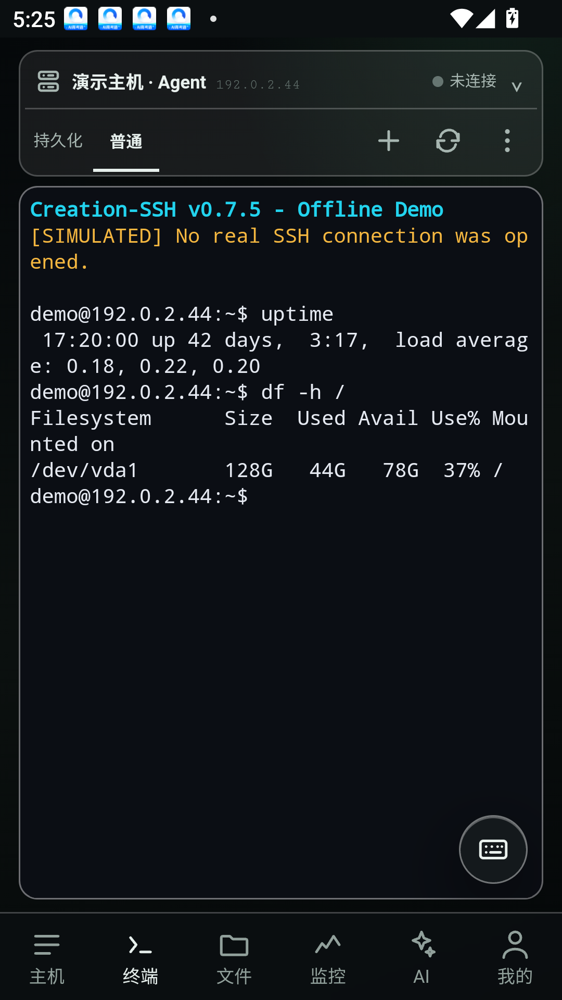

Switch between reconnectable tmux sessions and standard SSH terminals while managing the active window. Persistent sessions can be reattached so command-line work can continue on mobile.

#### File Manager

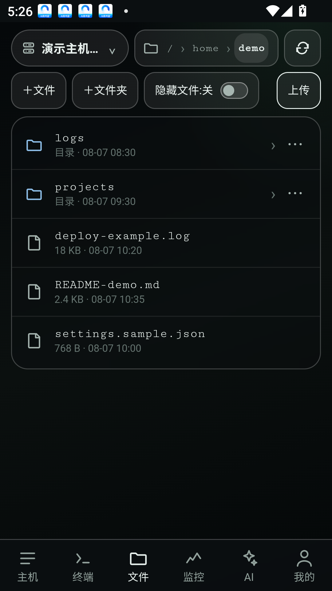

Use the compact two-row toolbar to browse remote directories, collapse deep paths, create files or folders, and toggle hidden items. Android's system picker selects one local file for upload and also chooses download destinations.

#### Live Monitoring

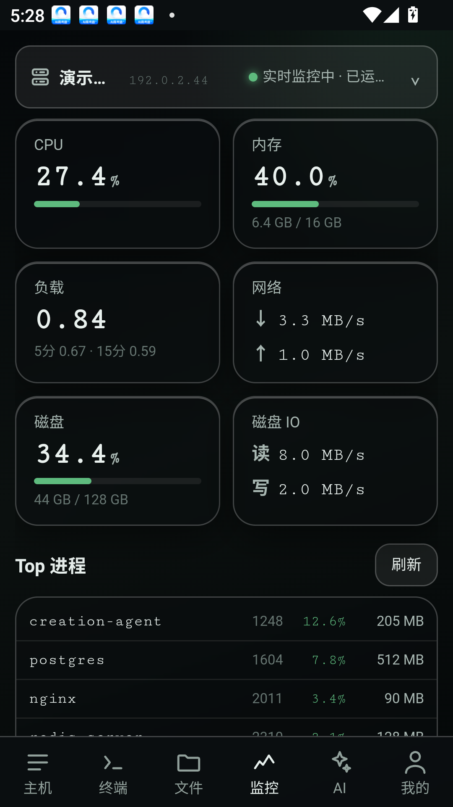

Monitor CPU, memory, load, network, disk usage, disk I/O, and top processes in real time. The page also shows monitoring health and uptime for quick mobile checks.

#### AI Assistant

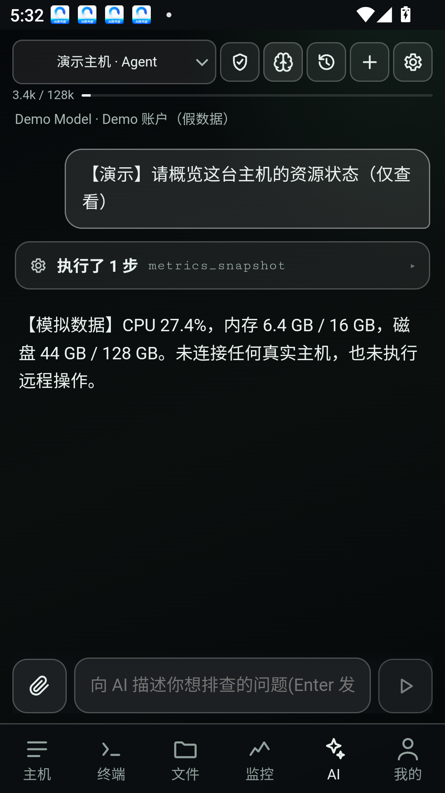

Select a target host, model, and permission profile before chatting with the AI, with controls for context, history, and settings. The screenshot shows a real read-only response, while tool execution remains governed by permissions and confirmation.

### Windows Desktop

Windows exposes the complete desktop navigation below and follows the host hard-delete and lifecycle-isolation contract.

| Page | What it does |
| --- | --- |
| Hosts | Groups, favorites, search, credential selection, plus agent deployment, repair, and status |
| AI assistant | Uses explicitly authorized host context for metrics, logs, files, and tools; desktop supports a separate AI window |
| Terminal | Dual tmux-persistent and standard SSH PTY modes, including persistent-window recovery after disconnects or device changes, plus multiple separate terminal windows for parallel work |
| Monitoring | Fleet health overview, per-host live details, and historical time-range queries |
| Files | Remote file management, online editing, chunked transfer, resume, and integrity verification |
| Port forwarding | SSH local forwarding, bound to `127.0.0.1` by default, with saved start/stop controls |
| Broadcast execution | Select hosts, enter a command or UTF-8 `.sh` file, freeze confirmation, execute through the agent, and review per-host results |
| System management | System facts, processes, firewall ports, and SSH password management |
| App Center | Install Docker, deploy apps such as Nginx/Redis, and manage containers, images, and systemd services |
| Access grants | Review the local vault, SSH keys, one-time grants, and AI audit records |
| Settings | AI provider, language, appearance, local login, monitoring collection, and update checks |

### Desktop Product Screenshots

Each Windows screenshot below is paired with one feature description and has been reviewed for redaction.

#### Host Management

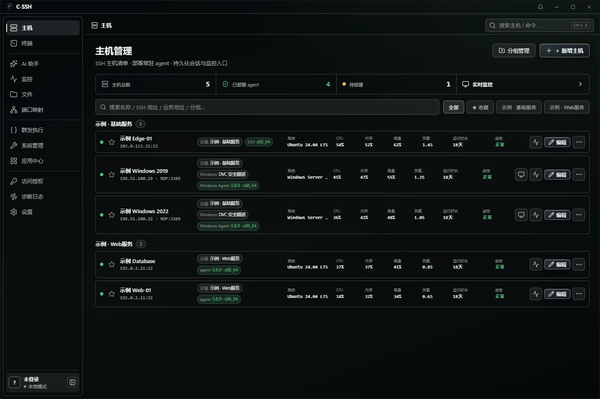

Manage SSH hosts through groups, favorites, and search while reviewing agent status and live metrics. Deletion clears attributable credentials, session history, window persistence, and monitoring cache instead of allowing a later host to inherit old state.

#### Persistent And Standard Terminals

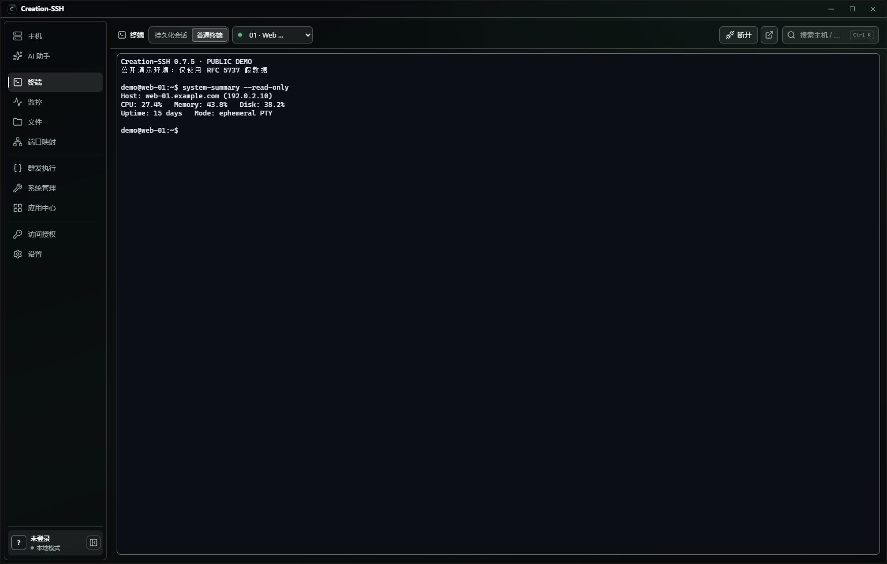

Select a host and switch between persistent tmux sessions and a standard SSH PTY. Standard terminals keep their live state across menu navigation, while persistent windows can be reattached after disconnects or device changes; a separate-window action supports parallel terminal work.

#### Multi-host Monitoring Overview

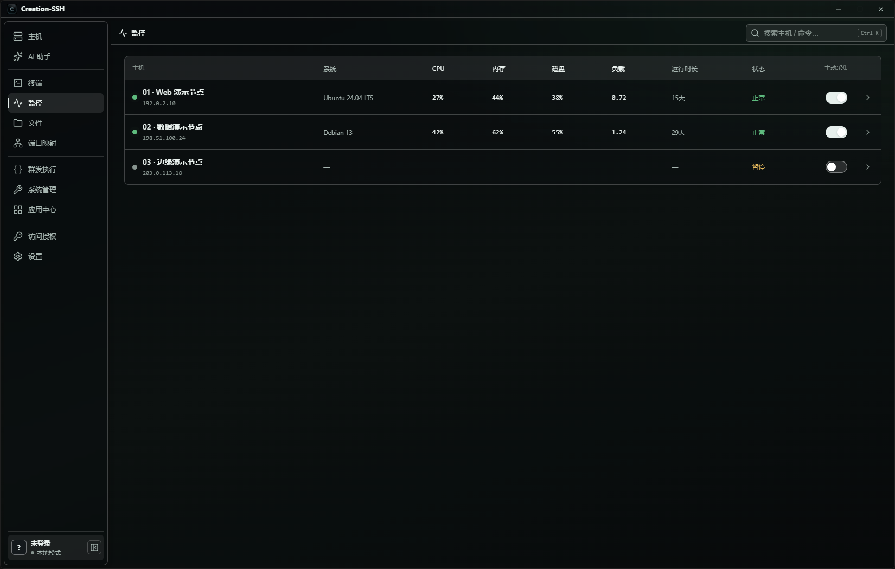

Compare CPU, memory, and live status across hosts while controlling active collection. Select any host to open its detailed monitoring view.

#### Per-host Monitoring Details

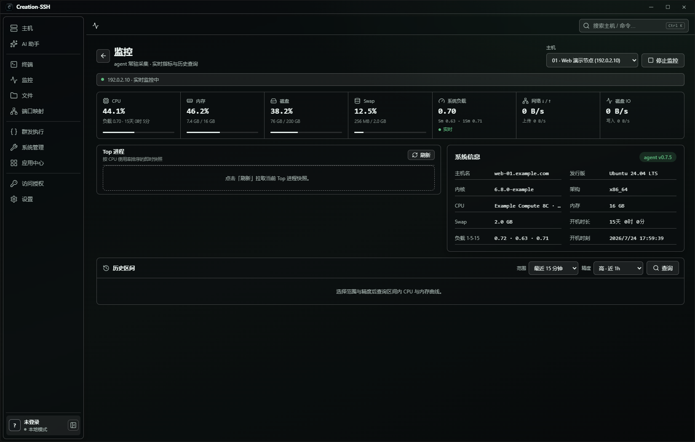

Inspect CPU, memory, disk, swap, load, network, and disk I/O for one host. Trend charts show recent changes, while top-process data helps identify resource usage.

#### File Manager

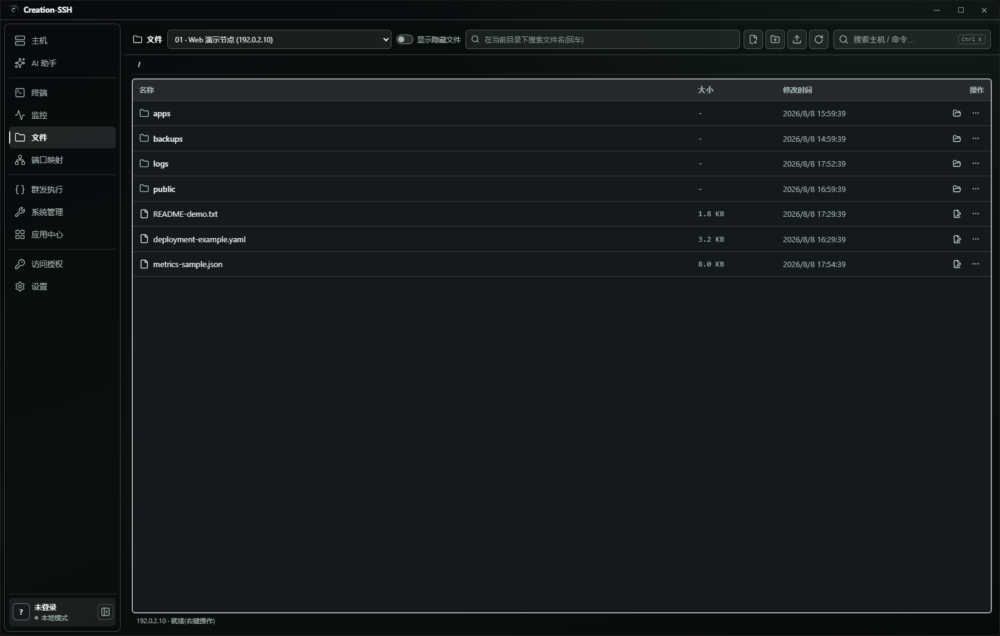

Browse and search remote directories, show hidden files, and create, upload, download, edit, or refresh items. The listing includes sizes, modification times, and per-item actions.

#### AI Assistant

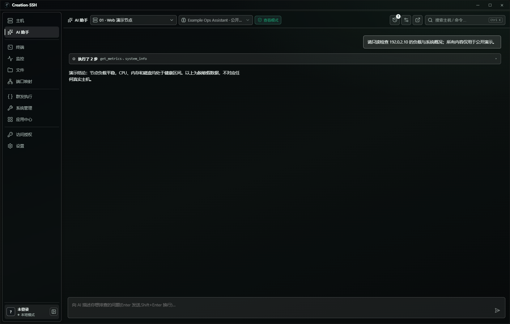

Select a host, model, and permission profile so the AI can read authorized metrics and system information and return a result. The page also provides history, context settings, and a separate AI window.

#### Broadcast Execution

Select one or more hosts, enter a command or UTF-8 `.sh` file, freeze the confirmation, and execute through the structured agent protocol. Per-host results remain isolated and use redacted aliases; AI summarization is always an explicit action.

#### Access Grants

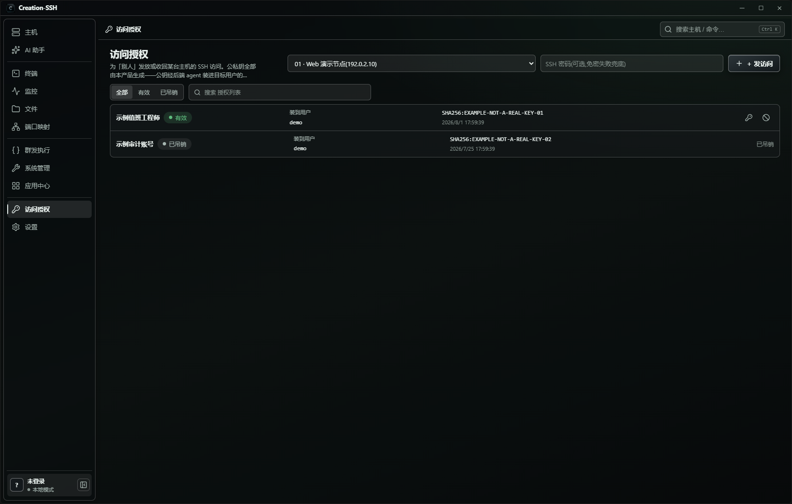

Create an independent temporary SSH access key for a selected host, with the private key shown only when the grant is created. Revoke the grant at any time without sharing the host's long-term credentials.

#### Settings

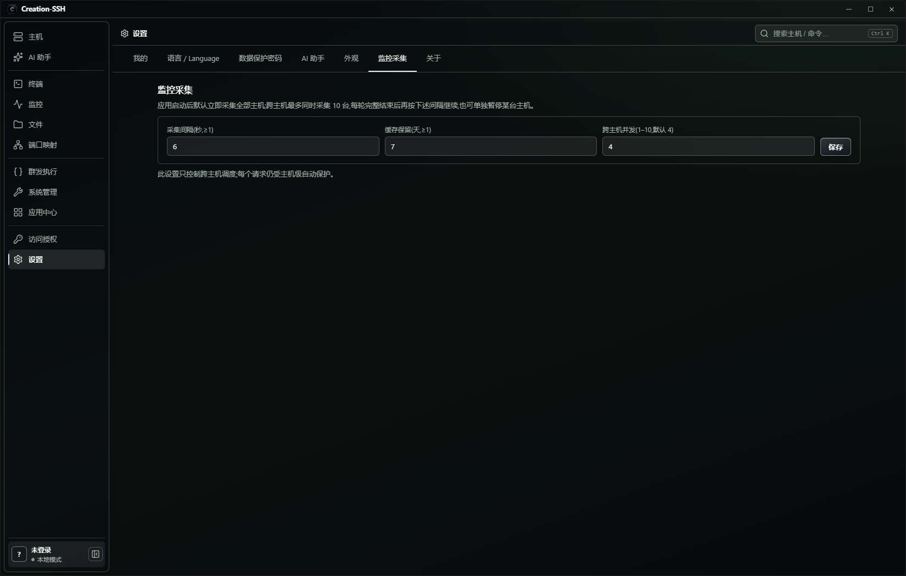

Configure system-language following, local login and vault protection, AI providers, appearance, and monitoring collection in one place. The About view exposes the current version and update check, while persistent settings stay local.

## Security Boundaries

- Private keys and passwords stay in the current device's local encrypted vault. They are not uploaded to servers or a C-SSH cloud; C-SSH does not provide a hosted credential service.
- The agent is reached through an SSH tunnel and listens only on a server-local Unix socket. It exposes no extra public port and runs as the current SSH login identity without self-elevation.
- Host-key anomalies stop the connection, and destructive actions require explicit confirmation. An unreachable host allows local-only deletion only before remote cleanup begins; once remote state is involved, uncertain ownership or incomplete cleanup fails closed.
- Port forwarding binds to `127.0.0.1` by default. Users who choose another listen address are responsible for evaluating LAN exposure.
- AI tools are controlled by permission profiles and execution confirmation. When a third-party AI provider is used, selected conversations and context are processed under that provider's terms.

## Free, Languages, And Open-Source Plan

Creation-SSH is currently free forever, with no subscription, paid tier, or feature lock. The interface includes Simplified Chinese, Traditional Chinese, English, Spanish, French, German, Portuguese, Russian, and Korean.

**The current release is not open source.** This repository contains the public product introduction, screenshots, and Release assets only. The plan is to open-source the project after the official iOS and macOS releases. That is a roadmap statement, not a claim that source is available now or a commitment to a specific date.

## Contact

- WeChat: `suiyue_creation`
- QQ Group (AI Innovation Community): [Join here](https://qm.qq.com/q/OWYQ9hwFWy)

### QQ Group: AI Innovation Community

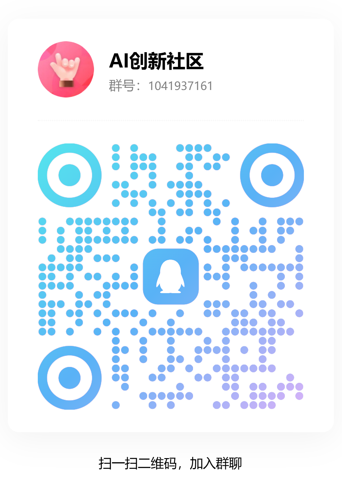

Scan the QR code or use the link above to join, Group No. `1041937161`. The group is for product experience, issue feedback, and future release discussions.
