# C-SSH 0.8.9 · Android 界面图集 / Screenshot Gallery

[返回首页 / Home](../README.md) · [图集目录 / Index](README.md)

共 24 张。当前 0.8.9 前端的离线示例界面，使用示例主机、RFC 5737 地址和 example.com；没有连接服务器、Cloud 或 AI provider。长页面按实际滚动位置展示。

24 screens from the current 0.8.9 frontend with offline sample data. No server, Cloud or AI-provider connection was made. Long pages are shown at their captured scroll positions.

安装三张图复用 2026-09-13 的MuMu产品界面；进度图为状态回放。其余图为后台浏览器渲染，不是原生安装、真机或业务链验收证据。0.8.9 程序尚未上传。

The three installation images reuse September 13 product UI captures; progress is a state replay. Other images are background browser renders, not native-device or functional acceptance evidence. 0.8.9 binaries are not uploaded.

## 01 · 主机清单 / Hosts

## 02 · Windows 三种访问模式 / Windows access modes

<a href="v0.8.9/android-add-windows-server.png">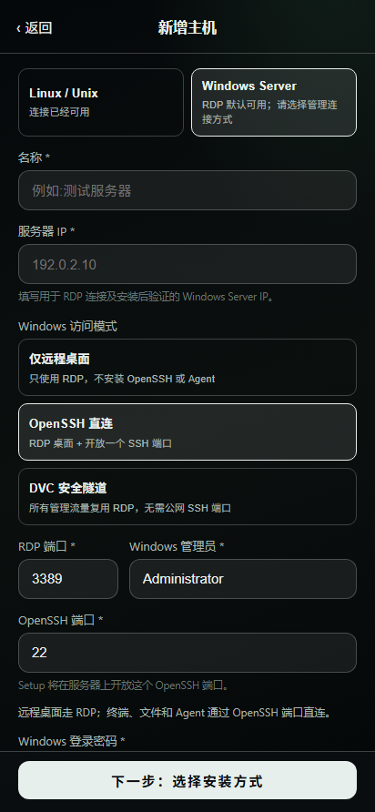</a>

## 03 · 自动或手动安装 / Automatic or manual installation

## 04 · 手动导出 Setup / Manual Setup export

## 05 · 安装进度与接管入口 / Installation progress and takeover

## 06 · 移动终端 / Mobile terminal

<a href="v0.8.9/android-terminal.png">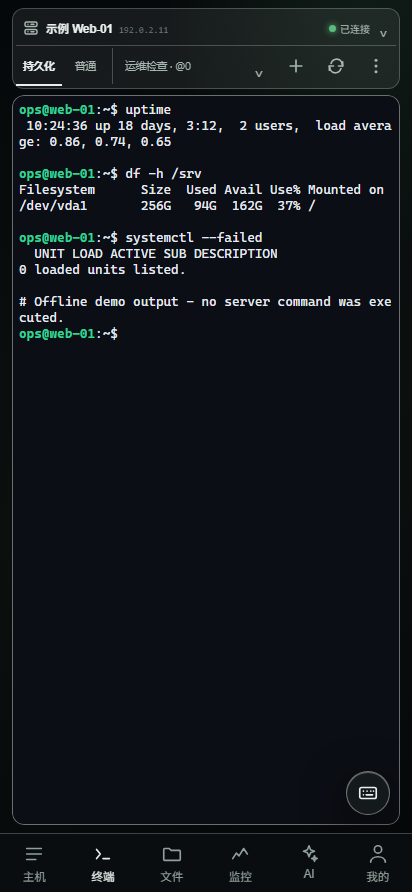</a>

## 07 · 文件管理 / File manager

<a href="v0.8.9/android-files.png">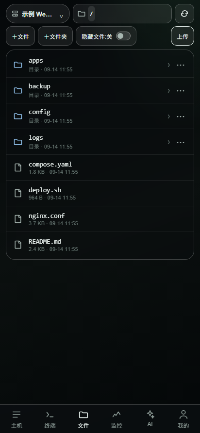</a>

## 08 · 监控与 Top 进程 / Monitoring and top processes

## 09 · 系统信息 / System information

<a href="v0.8.9/android-system.png">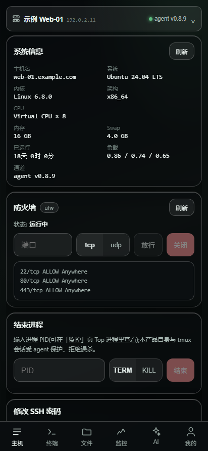</a>

## 10 · 防火墙与系统操作 / Firewall and system actions

<a href="v0.8.9/android-firewall.png">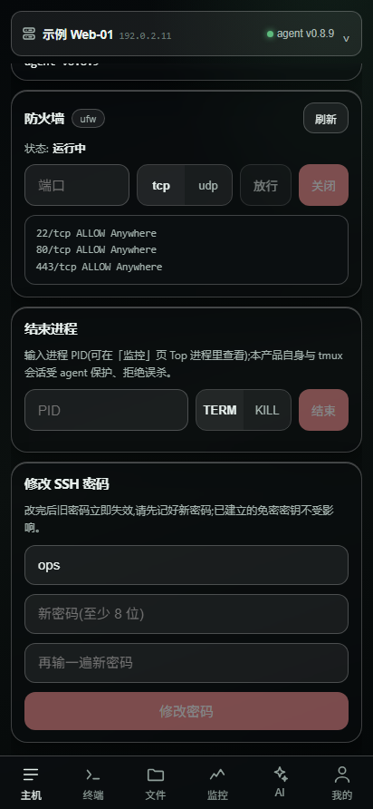</a>

## 11 · AI 示例对话 / AI sample conversation

## 12 · AI 历史对话 / AI conversation history

<a href="v0.8.9/android-ai-host.png">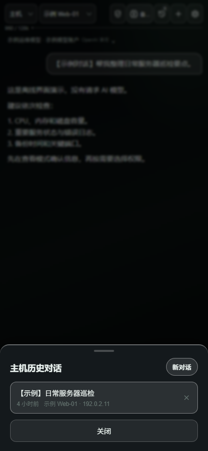</a>

## 13 · 模型账户与绑定 / Model accounts and bindings

<a href="v0.8.9/android-ai-models.png">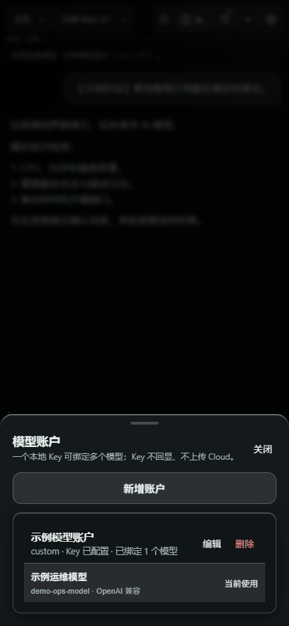</a>

## 14 · 本地模式与可选登录 / Local mode and optional login

<a href="v0.8.9/android-local-account.png">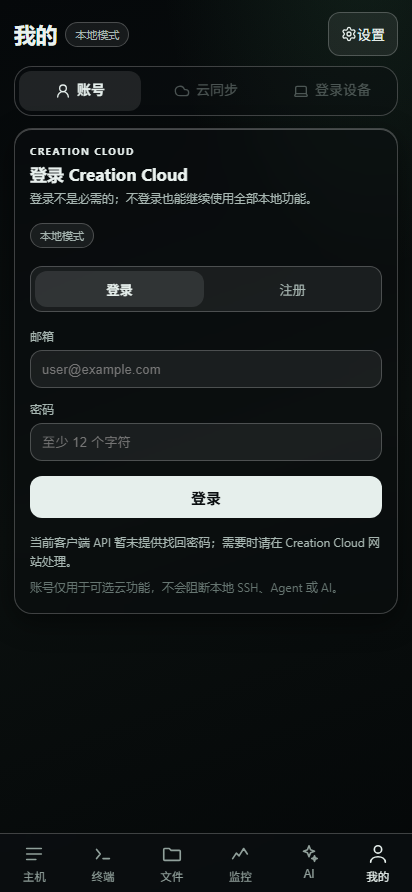</a>

## 15 · 账号概览 / Account overview

<a href="v0.8.9/android-cloud-account.png">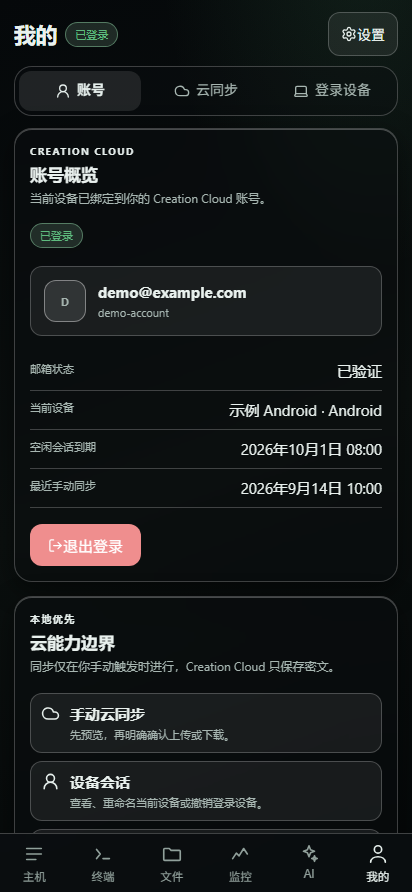</a>

## 16 · 手动同步入口 / Manual sync entry

<a href="v0.8.9/android-cloud-sync.png">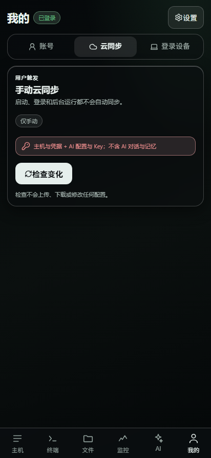</a>

## 17 · 紧凑同步变化清单 / Compact sync change preview

<a href="v0.8.9/android-cloud-changes-final.png">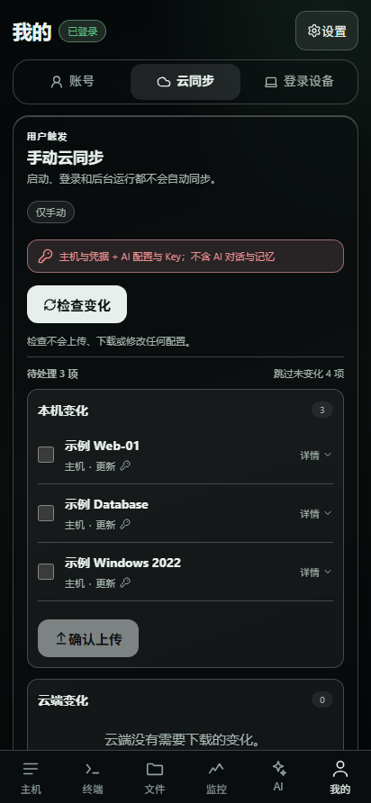</a>

## 18 · 登录设备会话 / Device sessions

<a href="v0.8.9/android-cloud-devices.png">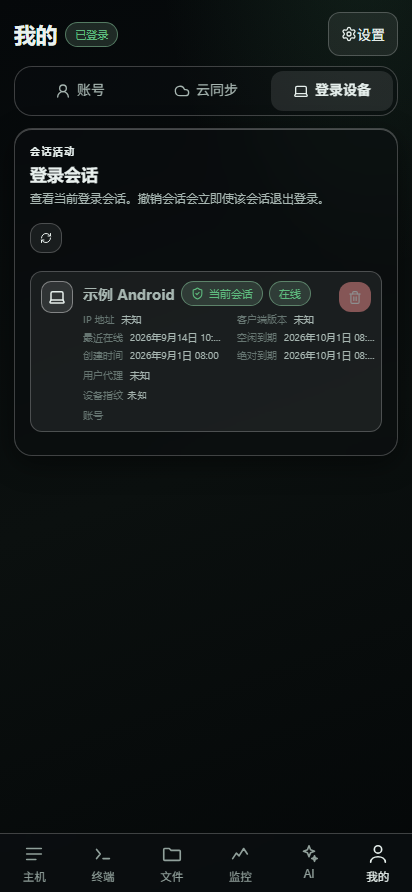</a>

## 19 · 数据保护设置 / Data protection

<a href="v0.8.9/android-data-protection.png">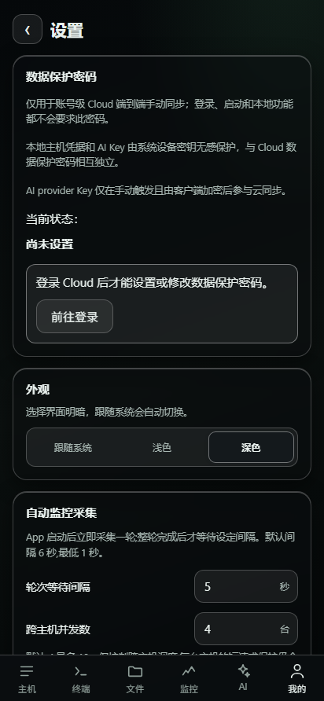</a>

## 20 · 外观与监控采集 / Appearance and collection

<a href="v0.8.9/android-appearance.png">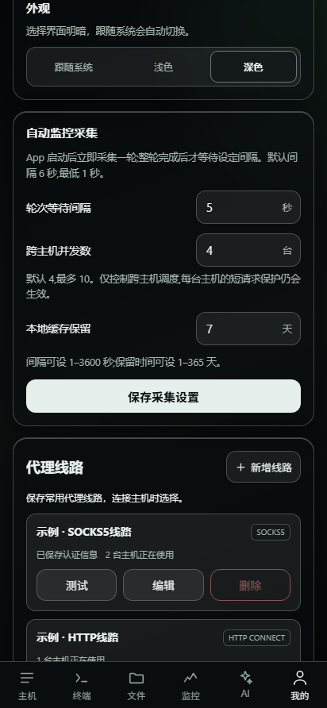</a>

## 21 · 代理线路 / Proxy profiles

<a href="v0.8.9/android-proxy-profiles.png">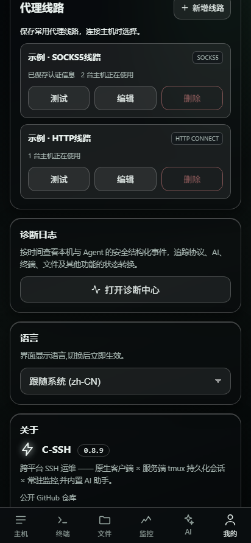</a>

## 22 · 诊断日志默认关闭 / Diagnostics off by default

<a href="v0.8.9/android-diagnostics.png">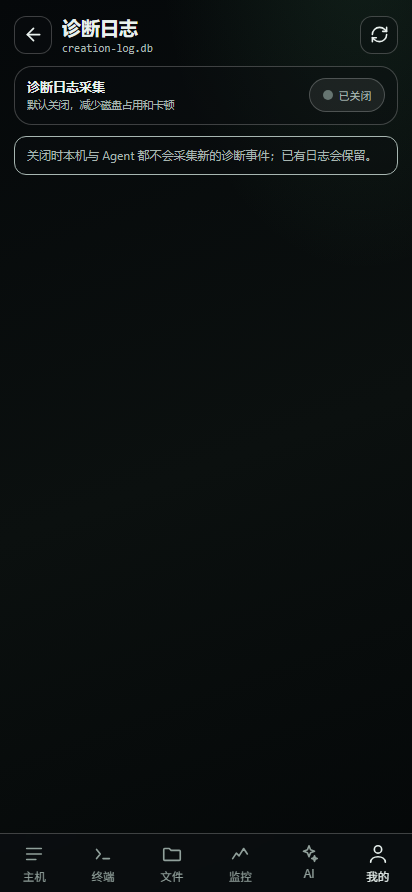</a>

## 23 · 语言、关于与更新 / Language, about and updates

<a href="v0.8.9/android-about.png">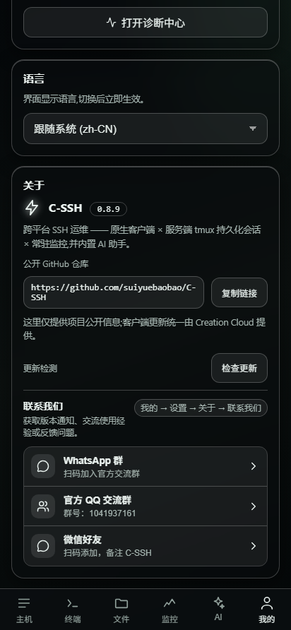</a>

## 24 · 非阻断本地模式提示 / Nonblocking local-mode notice

<a href="v0.8.9/android-local-mode.png">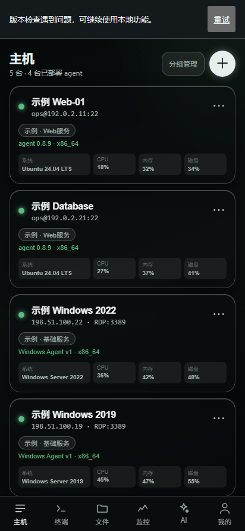</a>
