# Android 0.9.0 Screenshot gallery

[Index](README_EN.md) · [Features](../FEATURES_EN.md)

These are real 0.9.0 Vue views rendered in a background browser with synthetic, non-networked demo data. They show UI, not native-device or real-server test evidence. Personal contact panels are excluded.

## Hosts and projects

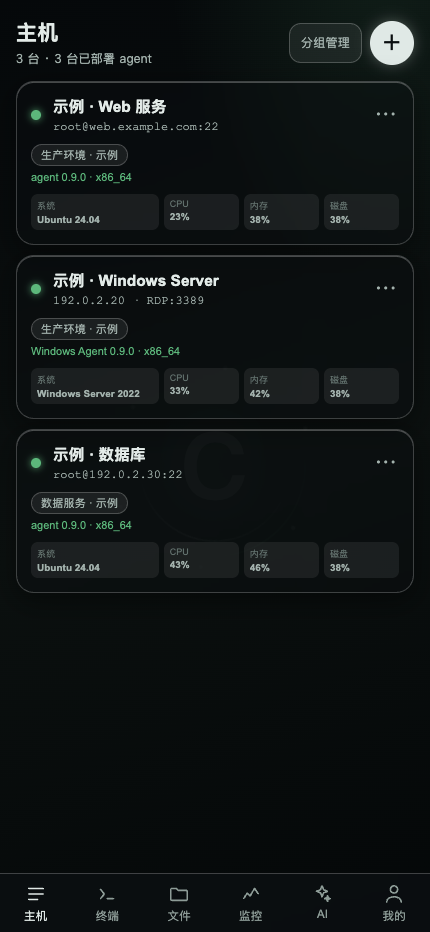

## Add an IPv4 host

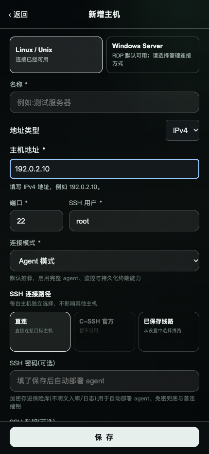

## Add a domain host

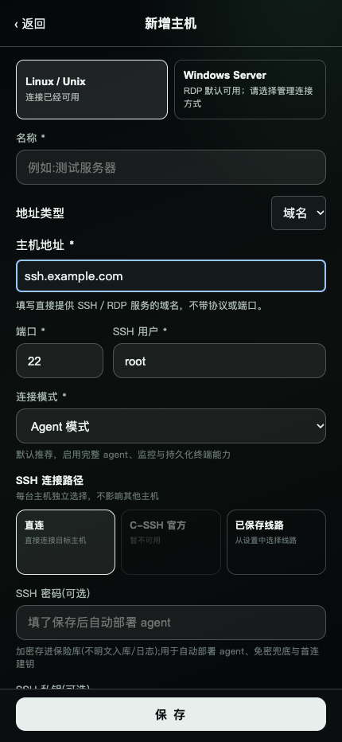

## Windows management connection

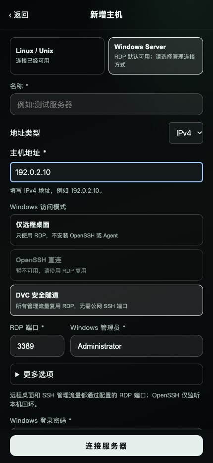

## Terminal entry

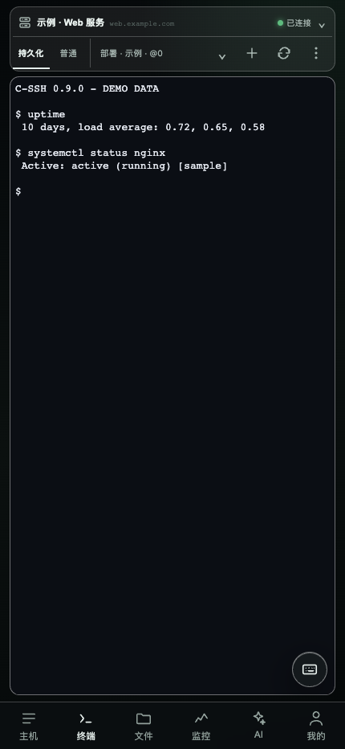

## Monitoring overview

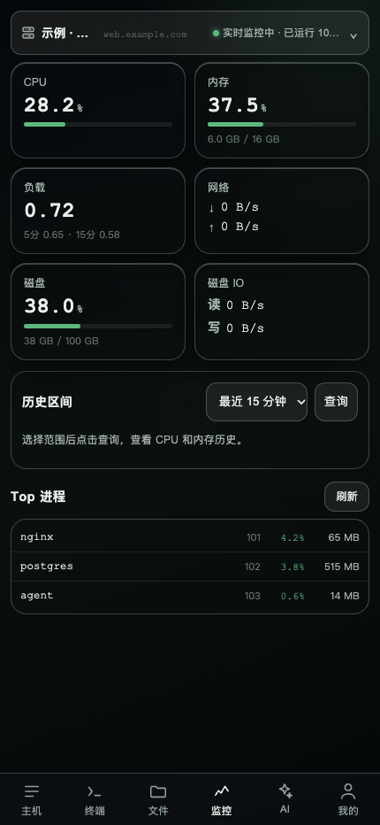

## File management

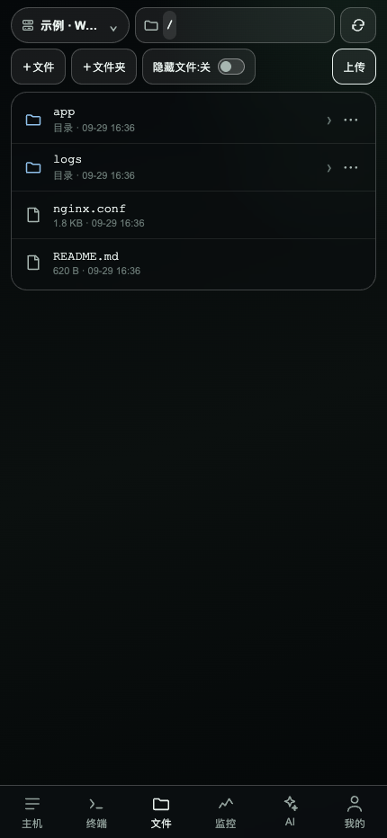

## Global AI

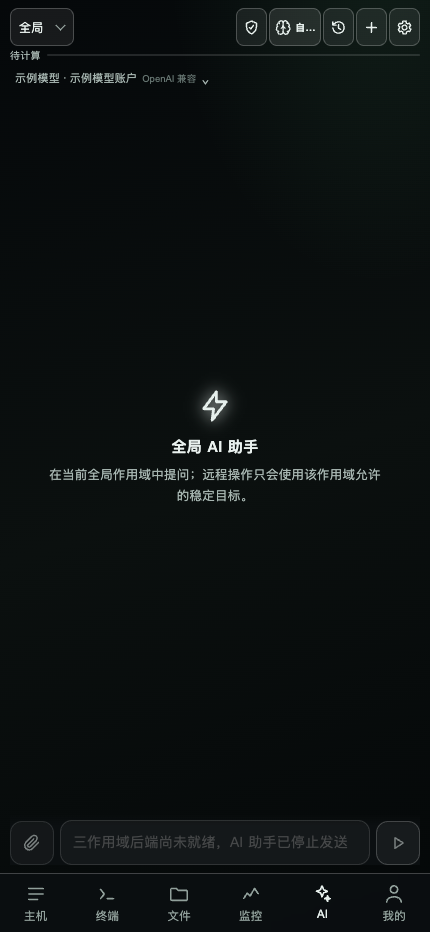

## Project AI

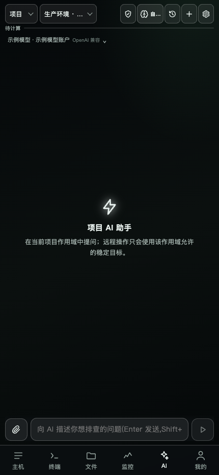

## Host AI

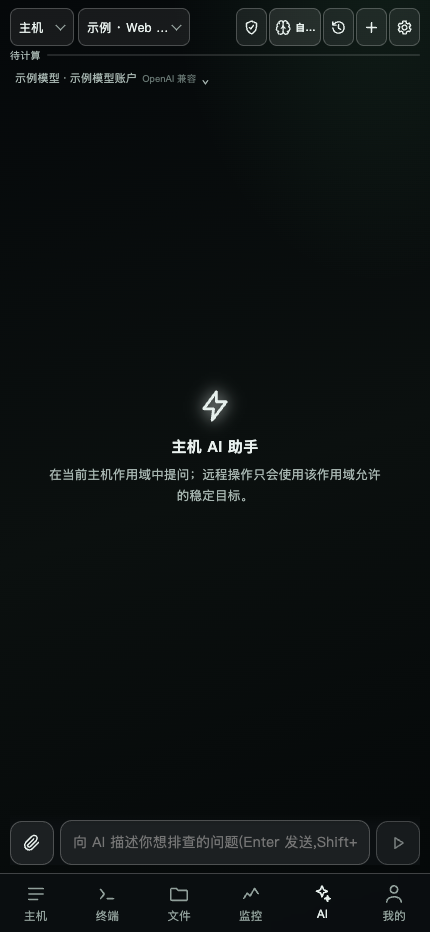

## System management

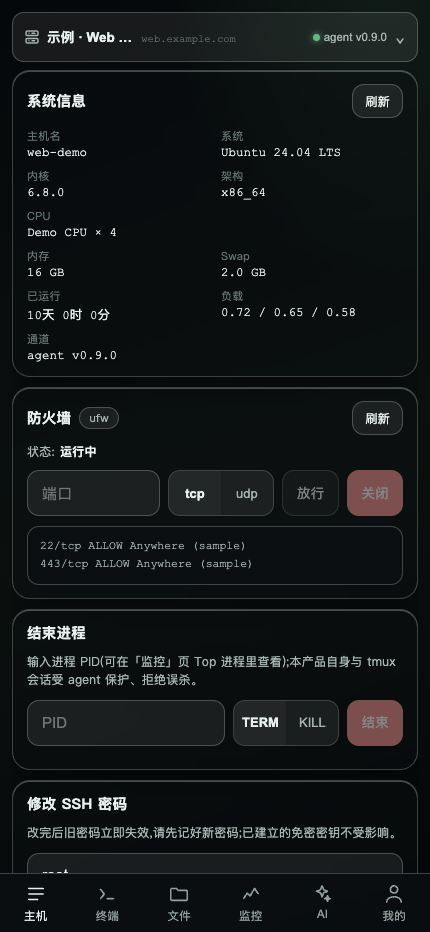

## Diagnostics

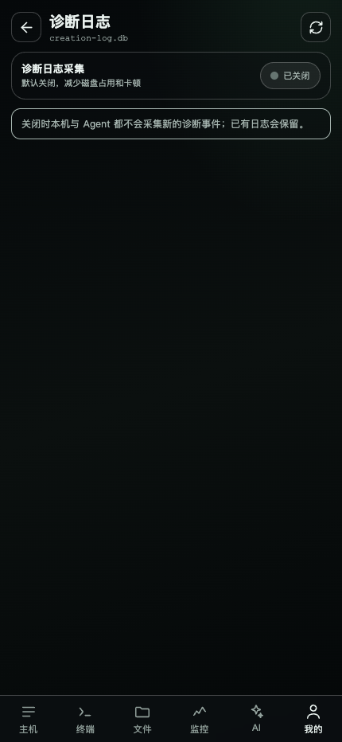

## Self-hosted cloud

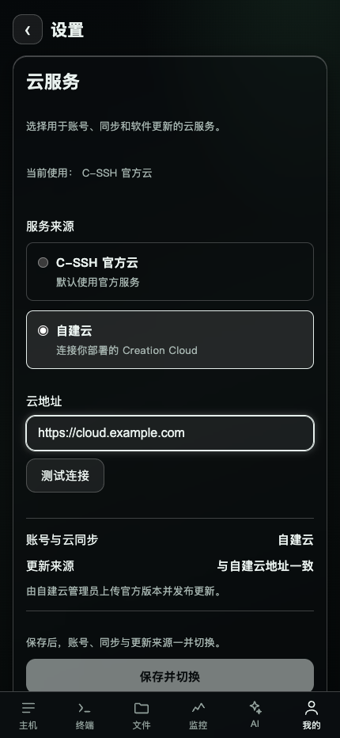

## About

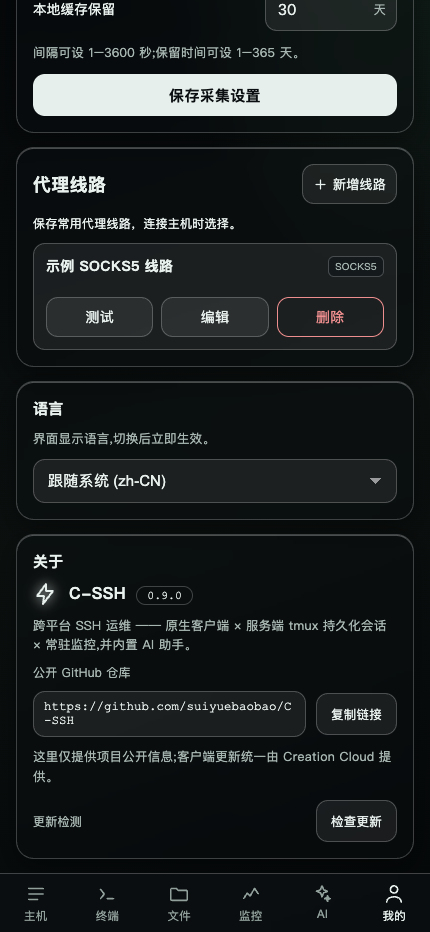

## Settings

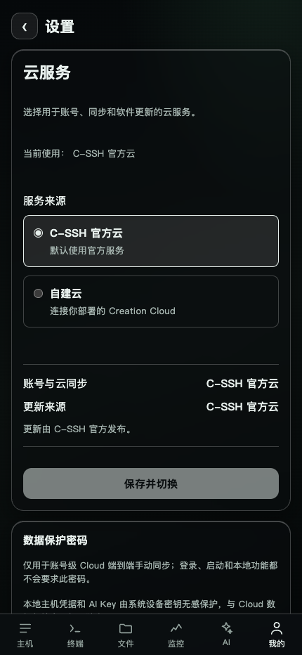

## Proxy profiles

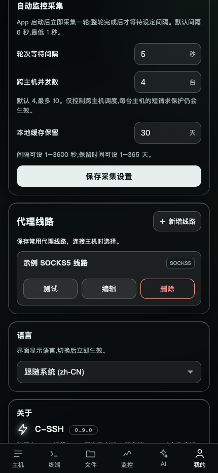

## Appearance

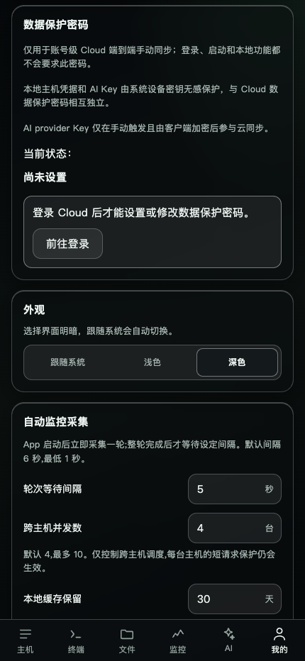

## Me

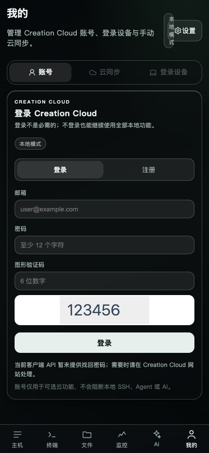
