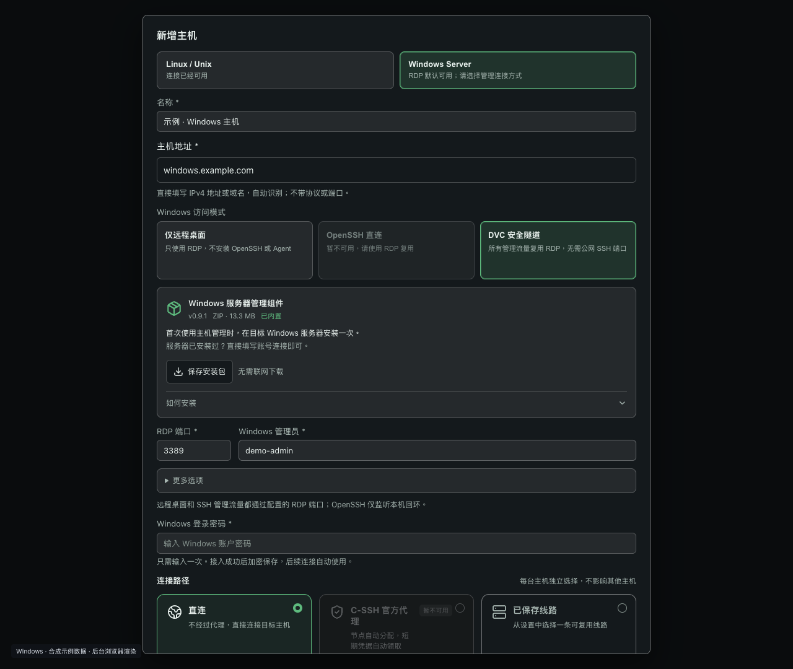
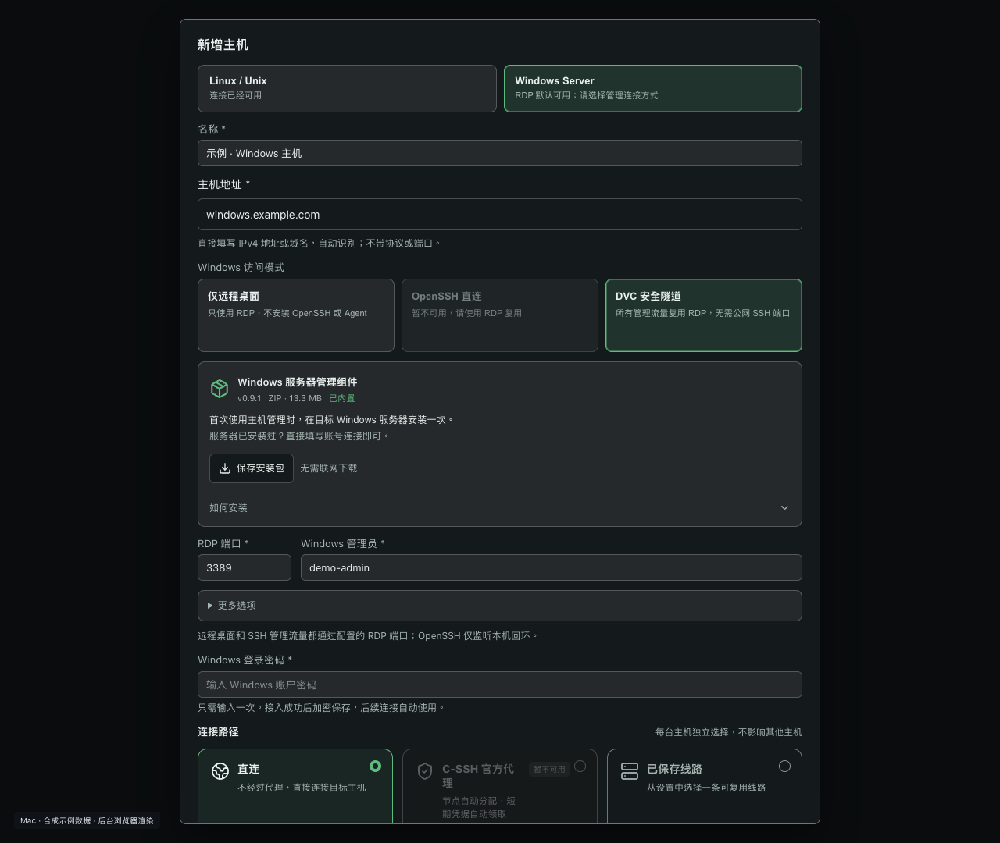
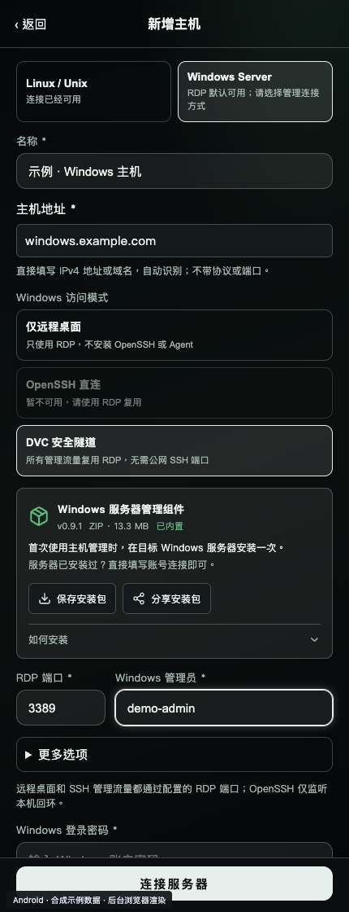

# New 0.9.1 host form

[中文](README.md) · [Full gallery](../README_EN.md)

Real Vue forms rendered in a background browser with synthetic sample data. These are UI illustrations, not native-app, physical-device, remote-connection or system export/share acceptance evidence.

- One address field detects IPv4 or domains; ports are separate.
- DVC management shows the Windows Setup ZIP export card; Android also offers system sharing. RDP-only mode hides the card.
- Sample component version 0.9.1; actual ZIP size 13,308,604 bytes. No connection, export or share action was executed for screenshots.

